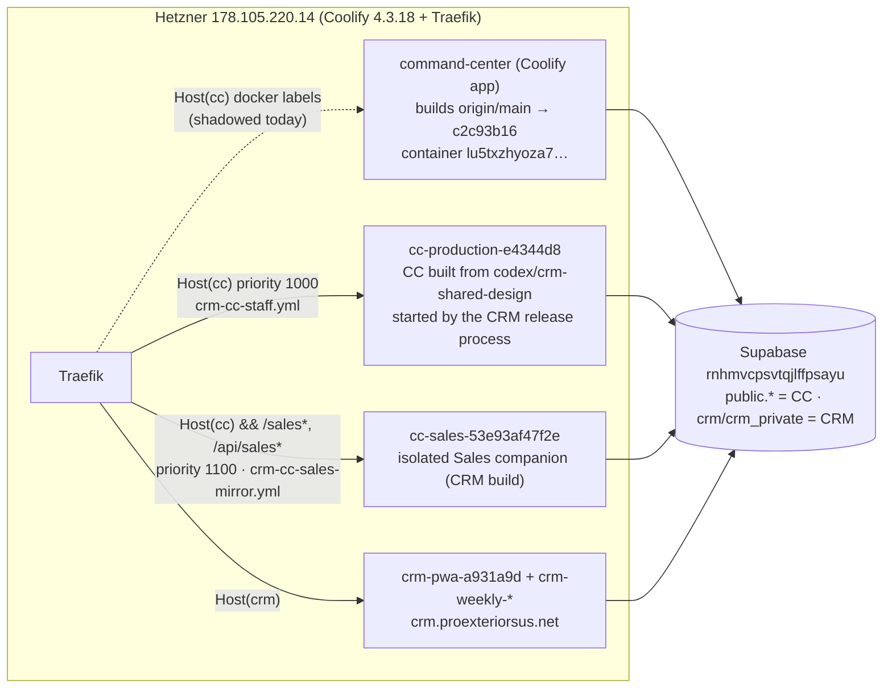

# 110 — Command Center ⇄ CRM boundary: back to `main`, keep the Sales mirror

**Date:** 2026-09-11 · **Asked by:** Chris · **Status:** recommendation, awaiting go on §4
**Companion:** [docs/109](109-runtime-uptime-dashboard-decision-log.md) (runtime board, F4/F20/F22 are the symptoms this document explains)

## 1. What actually exists (verified on the host, not inferred)

| Fact | Evidence |
|---|---|
| **Coolify auto-deploys `main` and it works.** The Coolify-managed container is running `c2c93b16` (today's push) and answers `/healthz` correctly from inside. | `docker ps`, `SOURCE_COMMIT`, in-container fetch 17:00 UTC |
| **Nothing reaches it.** Two Traefik dynamic files written by the CRM release process override the host: `crm-cc-staff.yml` sends *every* `cc.proexteriorsus.net` request (priority 1000) to `cc-production-e4344d8`; `crm-cc-sales-mirror.yml` sends `/sales*`, `/api/sales*`, `/sales-mirror-assets/*` (priority 1100) to `cc-sales-53e93af47f2e`. Coolify's label routers have default priority and lose. | `/data/coolify/proxy/dynamic/*.yml`; scripts in `/opt/crm-release-ex121/` and `CRM_PWA/scripts/switch-weekly-release-routes.py`, `restore-original-cc.py` |
| So "production runs the CRM branch" (docs/109 F4) was never a Coolify branch setting. It is a **proxy override**. Pushing `main` always deployed; the public hostname was pointed elsewhere. | — |
| The three CC containers share the same `WORKOS_COOKIE_PASSWORD` and `WORKOS_CLIENT_ID`, so a WorkOS session cookie minted by one is valid on the others. Path-based composition is therefore safe. | sha256 of env values compared on host |
| The Sales companion is self-contained: its own build (`53e93af`), own `/healthz`, assets under `/sales-mirror-assets/`. It does not call `cc-production`. | in-container fetch |
| The CRM is a separate system. It owns schemas `crm` (30 tables, 38 RPCs), `crm_private` (36 tables, 119 fns) and `crm_gateway`; the CC owns `public.*`. Both are additive on the one shared project. | `pg_class`, `pg_proc` |
| CRM canonical data is still empty: `crm.efforts` 0, `crm.people` 0, `crm.appointments` 0; `crm.weekly_items` 156, `crm.memberships` 37. The mirror today shows the weekly review workload, not a lead pipeline. `public.crm_pipeline` (11,456 rows) is the legacy GoHighLevel mirror the current `main` Sales tab counts. | SQL 16:5x UTC |
| The CRM branch in the CC repo (`codex/crm-shared-design`, 36 commits) is how the companion is *built*: vendored `@proexteriors/*` tarballs (62 files, 2.8 MB, every version ever published), Astro 6→7, React 19, a rewritten middleware (PKCE staff sessions, sales-only routing), the CRM design package replacing 79 lines of `global.css`. Three of its commits are CC-only fixes worth keeping: `e13d83b1` (unknown financial states), `69e211cb` (fixed-cost input validation), `4a5843e2` (AccuLynx failure preserves observations). | `git diff --stat 40a917e9 e4344d8b` |
| `crm.list_efforts` / `read_effort` / `list_weekly_*` are `SECURITY DEFINER`, granted to `authenticated` and `member` only, and resolve the actor from a WorkOS JWT. A CC service-role client could bypass RLS but would violate the CRM's stated contract ("never substitute an all-powerful database client"). | `pg_proc.proacl`, CRM `docs/architecture/OVERVIEW.md` |

## 2. The question, restated

"Move us back to `main` while retaining the CRM mirror via the Sales tab; two distinct systems sharing one Supabase SOT."

Three ways to draw the line:

| Option | Where the boundary lives | Pros | Cons |
|---|---|---|---|
| **A. Path mount (recommended)** — `main` serves the CC; the CRM owns `/sales` and `/api/sales` *on the CC host* through the existing path-scoped Traefik route to its companion container. | Reverse proxy, one file, versioned in the CRM release runbook. | Zero code coupling in the CC repo (no tarballs, no Astro/React upgrade, no middleware rewrite). Each system deploys on its own cadence. Sales edits in the CRM appear in the CC tab immediately because it *is* the CRM's own workspace. Already 90 % in place. | The Sales tab's chrome comes from the companion's build, so its nav/design must track the CC's (the CRM team already runs a design-parity check). Two containers answer one hostname — must be documented or it looks like drift (it did). |
| **B. Fast-forward `main` to the CRM branch** — accept the embedded companion as the CC. | npm packages + shared middleware. | One container, one lineage. | The CC becomes a consumer of a private package train (60+ tarball versions in git), inherits a 9/10 auth rollback incident, Astro 7/React for a surface most of the app doesn't use; every CRM release forces a CC release. Highest ongoing coupling. |
| **C. Link out / iframe** — `main` serves the CC; Sales tab links to `crm.proexteriorsus.net`. | Browser. | Trivial. | Not a mirror; iframes fight the WorkOS gate and the PWA's offline shell. |

**Recommendation: A now, with a small DB-level read contract added later for CC-native widgets** (an executive KPI tile, a runtime-board feed light) so the CC never needs the CRM's code or its all-powerful client: the CRM publishes `crm_gateway.cc_*` read views/functions granted to a dedicated reader role; the CC treats them like any other `v_*` source. That is the same pattern the CC already uses for AccuLynx, QBO and ABC mirrors (normalise once, read many).

## 3. Ownership contract (proposed — record in both repos)

| Concern | Owner | Rule |
|---|---|---|
| `cc.proexteriorsus.net` host router | **Coolify app `command-center`** (builds `origin/main`) | No dynamic file may carry `Host(\`cc.proexteriorsus.net\`)` without a path restriction. `crm-cc-staff.yml` is retired. |
| `/sales`, `/sales/*`, `/api/sales`, `/api/sales/*`, `/sales-mirror-assets/*` on that host | **CRM release runbook** (`crm-cc-sales-mirror.yml`) | Path-scoped only; upstream is the current companion container; file checked into `CRM_PWA` and mirrored read-only under `deployment/proxy/` in this repo. |
| WorkOS session interoperability | Both, via Coolify env | `WORKOS_COOKIE_PASSWORD`, `WORKOS_CLIENT_ID`, `COMMAND_CENTER_PUBLIC_URL` identical on every container that answers the host. |
| Data | CRM: `crm`, `crm_private`, `crm_gateway`. CC: `public`, `runtime_*`, `qbo_registers`, `jt_mirror`, … | Additive only (hard rule 1). CC reads CRM data only through `crm_gateway` objects the CRM publishes for it. |
| Drift detection | Runtime board (docs/109) | New light: "host override present" (any dynamic file matching `Host(cc)` without a path prefix) and "public buildCommit ≠ Coolify SOURCE_COMMIT". |
| The CRM branch in this repo | Archive | `codex/crm-shared-design` is renamed `archive/crm-shared-design-2026-09` after the three CC-only fixes are cherry-picked into `main`. |

## 4. Execution plan (≈15 min, all reversible)

1. **Cherry-pick the three CC-only fixes** into `main` (`e13d83b1`, `69e211cb`, `4a5843e2`), build + tests, push. Coolify rebuilds `main`.
2. **Set `COMMAND_CENTER_PUBLIC_URL=https://cc.proexteriorsus.net`** on the Coolify app (it is only on the CRM-built containers today) and redeploy.
3. **Retire the host-wide override**: move `/data/coolify/proxy/dynamic/crm-cc-staff.yml` to `/data/coolify/proxy/retired/crm-cc-staff.yml.2026-09-11`. Traefik hot-reloads; the Coolify label router takes the host. `crm-cc-sales-mirror.yml` stays.
4. **Verify** from outside: `/healthz` → `buildCommit` of the new `main` build; `/sales` → companion (`53e93af`); `/accounting/invoice-audit` renders the audited invoice; `/agents` shows the board. From the runtime board: deploy light green.
5. **Stop (do not remove) `cc-production-e4344d8`** after 24 h green; keep the image for rollback.
6. **Archive the branch**, add the drift light (§3), and file the ownership contract in `CRM_PWA/docs/delivery/` via the CRM team's runbook so `switch-weekly-release-routes.py` never writes a host-wide router again.

**Rollback (any step):** put `crm-cc-staff.yml` back from `/opt/crm-release-ex121/routes/cc-production.private.yml` — Traefik reloads in seconds and the host is served by `cc-production-e4344d8` exactly as today.

## 5. Later: the DB-level mirror for CC-native widgets

When the CRM has real efforts/appointments, publish (CRM-owned migration):
`crm_gateway.cc_pipeline_summary` (stage counts by office/week), `crm_gateway.cc_recent_activity` (last N interactions), `crm_gateway.cc_weekly_review_status` — granted to a `cc_reader` role the CC's server client can assume, no PII columns. The CC's Sales overview then shows CRM truth in CC components and the executive pipeline can retire `public.crm_pipeline` (GHL era). This is an A3 (rule 9): value = one source of truth for sales KPIs across both surfaces; cost = one migration + one loader.
