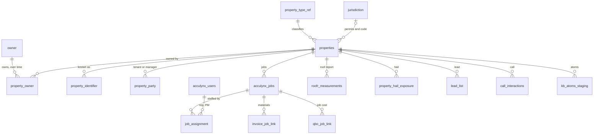

# 113 — Property Spine: one property, one parcel, every layer

**Status:** APPROVED — Chris, 2026-09-29. All recommendations below are approved, with the identity ruling in §1 replacing the earlier many-parcels-per-property draft.
**Scope:** the schema that ties one property UUID to every layer of the brain — county parcel data, hail and storm exposure, leads and calls, AccuLynx jobs, vendor invoices, Roofr reports, QBO job cost, sales reps, owners and code-era knowledge.
**Visual:** [Property Spine Schema](https://claude.ai/artifact/BmwgLJRNCjwnoveiGaV8kn) (private artifact; current-state and target ER diagrams). Its parcel section predates the §1 ruling; where they differ, this document wins.

**Short version.** `properties.id` (UUID) is the key everything points at. One property is exactly one APN/address, and it carries exactly one `geoid`. Properties never share a UUID; a campus or portfolio that spans several parcels is tied together by `owner_id`. Place facts (hail, leads, calls, Roofr, atoms) point at the property. Money and people (invoices, job cost, reps) point at the AccuLynx job, which points at the property. Every property carries a class, a type and an occupancy.

---

## 1. What one property is (the identity ruling)

Chris, 2026-09-29: *the APN/address defines what one property is. Multiple parcels do not link by property UUID; they link by owner ID. One owner may have many APN/addresses, and each APN/address is a single geoID.*

| Rule | Consequence in the schema |
|---|---|
| One property = one APN (or, until an APN is known, one normalized address + unit) | `UNIQUE (county_fips, apn_normalized)` and `UNIQUE (geoid)` on `properties`. A partial unique index on `address_key` covers address-only rows (`geoid IS NULL`). |
| Each property has exactly one geoID | `geoid` is a column on `properties`, not a child table. The `property_parcel` many-to-many table from the first draft is **dropped from the design** (it was never built). |
| Multi-parcel sites link through the owner | New `owner` + `property_owner` tables. A shopping center on three APNs is three properties with the same `owner_id`; `mv_owner_portfolio` rolls them up. |
| The UUID is the key; the geoID is an attribute | The geoID only exists where we have parcel data (today Collin TX and Sedgwick KS); jobs run in 27 states. Every table joins on `property_id`, never on `geoid`. |
| Units follow the APN | A condo unit with its own APN is its own property. Apartment or office units under one APN are one property; the unit lives on the job or the party row. |

**geoID format.** Existing values stay as they are: Collin `R-3805-00A-0010-1` and Sedgwick `SGK-00099003` are already unique per parcel and `lead_list`, `call_interactions` and `property_hail_exposure` are keyed on them. New counties mint `geoid = '<5-digit county FIPS>-<normalized APN>'`, where normalized means upper-case with spaces, dots and dashes removed. A superseded APN (split, merge, re-number) moves to `property_identifier` with `valid_to`, and the property keeps its UUID.

**Merges, never deletes.** When enrichment returns an APN already held by another property (two spellings of one address, e.g. `2001 W Plano Pkwy` and `2001 W Plano Pwky`), the older property survives. The other gets `status = 'merged'` and `merged_into_property_id`, and its child rows are re-pointed. Nothing is deleted (hard rule 1).

## 2. Property type

Chris, 2026-09-29: every property carries a type, commercial with its sub-categories, and residential split by occupancy and form.

Three columns on `properties`, all constrained by `property_type_ref`:

- `property_class`: `residential` | `commercial` | `land`
- `property_type`: the sub-category below
- `occupancy`: `owner_occupied` | `renter_occupied` | `vacant` | `unknown` (kept separate from type so it can change without reclassifying the building)

The display label combines them, e.g. *Residential · Single-family · Renter-occupied*.

| Class | `property_type` | Label |
|---|---|---|
| residential | `single_family` | Single-family detached |
| residential | `townhome` | Townhome / attached single-family |
| residential | `condo` | Condominium unit |
| residential | `multifamily_2_4` | Multi-family, 2–4 units (duplex to fourplex) |
| residential | `multifamily_5_plus` | Multi-family, 5+ units (apartment community) |
| residential | `manufactured` | Manufactured / mobile home |
| residential | `residential_other` | Residential, other |
| commercial | `office` | Office |
| commercial | `medical_office` | Medical office / clinic |
| commercial | `commercial_condo` | Commercial condominium unit (added 2026-09-29, docs/114) |
| commercial | `retail` | Retail, standalone |
| commercial | `shopping_center` | Shopping / strip center |
| commercial | `restaurant` | Restaurant |
| commercial | `hospitality` | Hotel / motel |
| commercial | `industrial_warehouse` | Warehouse / distribution |
| commercial | `industrial_manufacturing` | Manufacturing |
| commercial | `flex` | Flex / light industrial |
| commercial | `self_storage` | Self-storage |
| commercial | `auto` | Auto dealership / service / car wash |
| commercial | `parking` | Parking structure (added 2026-09-29, docs/114) |
| commercial | `healthcare` | Hospital / healthcare facility |
| commercial | `senior_living` | Senior / assisted living |
| commercial | `education` | School / university |
| commercial | `religious` | House of worship |
| commercial | `government` | Government / civic |
| commercial | `recreation` | Recreation / fitness / clubhouse |
| commercial | `hoa_common` | HOA common-area building |
| commercial | `mixed_use` | Mixed-use (retail or office with residential) |
| commercial | `agricultural` | Agricultural improvements (barns, farm buildings) |
| commercial | `commercial_other` | Commercial, other |
| land | `vacant_land` | Vacant lot / land, no structure |

Assessors usually file 5+ unit apartments under commercial. Here they sit under residential per the ruling, and the source-code map handles the translation.

### Where the type comes from (precedence, highest first)

1. **Human confirmation** in the review queue → `type_trust_tier = 'instruction'`.
2. **Enrichment vendor land-use code** (from the round trip in §4).
3. **County file.** Collin `propcategorycode` is the Texas state category code; Sedgwick carries `multi_unit_type`, `owner_type` and `is_owner_occupied`.
4. **AccuLynx `job_category_name`** (`Residential` 3,648 · `Commercial` 874 · `Property Management` 148 · blank 2,358 jobs). This is a hint only.

Sources 2–4 are stored as `evidence` (hard rule 4). Only a human confirmation or Quality Control raises a type to `instruction`.

**Collin state category code map** (codes measured in prod, 2026-09-29):

| Code | Collin rows | Maps to |
|---|---|---|
| A | 352,507 | residential · `single_family` (townhome/condo refined by enrichment) |
| B | 4,593 | residential · `multifamily_2_4` or `multifamily_5_plus` by unit count |
| C1 | 13,500 | land · `vacant_land` |
| D1 / E | 6,262 / 6,986 | land · `vacant_land` (ag / rural land) |
| D2 | 1,051 | commercial · `agricultural` |
| F1 | 28,204 | commercial · sub-type from use code / enrichment, else `commercial_other` |
| F2 | 216 | commercial · `industrial_manufacturing` or `industrial_warehouse` |
| M1 | 3,464 | residential · `manufactured` |
| O | 24,014 | residential · `single_family` (builder inventory) |

**Occupancy.** Collin `exempthmstdflag = true` → `owner_occupied`. Sedgwick `is_owner_occupied`. Otherwise, an owner mailing address that differs from the situs address → `renter_occupied`. `lead_list.occupancy_class` / `rental_flag` count as supporting evidence.

## 3. Target schema (all additive)

| Object | Grain | Key | Purpose |
|---|---|---|---|
| `properties` + new columns | APN/address | `id` uuid PK; `UNIQUE(geoid)`; `UNIQUE(county_fips, apn_normalized)`; partial `UNIQUE(address_key) WHERE geoid IS NULL` | Adds `apn`, `apn_normalized`, `county_fips`, `parcel_source`, `address_key`, `unit`, `geom` (PostGIS point), `jurisdiction_id`, `property_class`, `property_type`, `occupancy`, `type_source`, `type_trust_tier`, `units_count`, `status`, `merged_into_property_id` |
| `property_type_ref` | type code | `property_type` | The §2 taxonomy; FK target for `properties.property_type` |
| `owner` | legal owner | `id` uuid; `UNIQUE(owner_key)` | Normalized owner name + mailing address; `owner_type` (individual, LLC, trust, REIT, government, HOA) |
| `property_owner` | property × owner × period | `(property_id, owner_id, valid_from)` | Ownership history; the link for multi-parcel sites |
| `property_identifier` | outside ID | `(id_type, id_value)` | Legacy/superseded geoIDs and APNs, AccuLynx location, GHL property object, StormWatch research ID, EagleView report, each with `match_method`, `confidence`, `trust_tier`, `valid_from/to` |
| `property_party` | person × property × role × period | `(property_id, contact_id, role, valid_from)` | Tenants, property managers, HOA contacts (owners live in `property_owner`) |
| `job_assignment` | job × user × role | `(job_id, user_id, role)` | Sales rep / PM / estimator keyed to `acculynx_users` |
| `invoice_job_link` | vendor invoice | `(vendor_slug, invoice_number)` | Persists the matches the views already compute (ABC 904/1,149; SRS+QXO 68/74), plus a ship-to → property cross-check |
| `qbo_job_link` | QBO customer:job × job | `(qbo_customer_id, acculynx_job_id)` | Customer:Job suffix match used by the WIP/AR board |
| `property_id` columns | — | FK → `properties.id` | Added to `property_hail_exposure`, `lead_list`, `call_interactions`, `crm_pipeline`, `stormwatch_property_research`, `ihm_impact_reports`, `field_estimates`; `acculynx_job_id` added to `roofr_measurements` |
| `mv_property_360` | property | `property_id` | The enriched read surface (identity, type, parcel, owner, exposure, people, work, money, code). Materialized — a per-row view would hit the 8 s `statement_timeout` |
| `mv_owner_portfolio` | owner | `owner_id` | Every property an owner holds, with jobs and spend rolled up |
| `v_property_link_gaps` | link type | `link_type` | Counts unlinked jobs, invoices, reports, leads and untyped properties — the companion NULL counter for every derived key |

Existing `geoid` columns on the market tables stay in place for compatibility; `property_id` becomes the join.

## 4. Enrichment round trip (how every market gets parcel data)

Parcel data exists today only for Collin County TX (≈441K real-property accounts) and Sedgwick County KS (≈236K). AccuLynx jobs span 27 states, so their APNs come from an outside enrichment pass.

1. **Export.** `python3 scripts/export-acculynx-property-addresses.py [--out file.xlsx]` writes one row per unique address + unit in the template's column order (Address, Unit#, City, State, Zip, County, FIPS, APN#) plus a `Ref ID`. The `jobs` sheet maps each Ref ID to its AccuLynx job IDs, and `needs_address` lists jobs with no street. The script is read-only against the database. The first run (2026-09-29): 7,028 jobs → 6,347 properties; 6,954 jobs placed; 74 without a street; 315 properties with more than one job.
2. **Enrich.** The vendor fills County, FIPS and APN#. Ask for the land-use code, unit count, owner name and owner mailing address too; those feed §2 type/occupancy and the `owner` table.
3. **Import** (to build). Match each returned row by `Ref ID` against **that export's own `jobs` sheet**. Ref IDs are assigned per run, so they must never be matched against a later export. Upsert `properties` on `(county_fips, apn_normalized)`, merging duplicates per §1. Set `acculynx_jobs.property_id` with `property_link_method = 'enrichment_apn'`.
4. **Keep it current.** Run the same resolver in the AccuLynx sync so new jobs link on arrival: normalize the address, then match on existing APN/address, else create an address-only property and queue it for enrichment.

## 5. Build order

Every step is additive and idempotent. Take the next free migration numbers at build time (301+ as of this writing), and ship schema in its own same-day PR.

1. ✅ **Hub columns + reference tables** — migration 301 (2026-09-29): the new `properties` columns, `property_type_ref` (seeded with §2), `property_identifier`, `owner`, `property_owner`, plus `owner_contact_point`, `property_assessment` and `property_list_import`. The Collin CAD `geoid` index is deliberately **non-unique**: a future tax-year load appends rows with the same geoid, and `(propid, propyear)` is that table's own key. Migration 302 added the list loader and the CRM read views; the first load is docs/114.
2. **Seed from parcel files.** Create one property per Collin and Sedgwick parcel. Derive type/occupancy per §2, and derive owners from the owner name + mailing address.
3. ✅ **Resolve the AccuLynx jobs** — built 2026-09-29 (migrations 303, 304, 306; docs/115): 6,073 of 7,028 linked; the rest sit in `acculynx_job_property_review`. Match on address, then on point-in-parcel where parcel geometry exists. Create address-only properties elsewhere and backfill `acculynx_jobs.property_id` with method + confidence. Low-confidence matches go to the review queue.
4. **Money links.** Load `invoice_job_link` from `v_invoice_acculynx_match` / `v_vendor_invoice_acculynx_match`, and `qbo_job_link` from the WIP/AR suffix logic. Backfill `abc_line_items.acculynx_job_id`.
5. **People.** Build `job_assignment` from `crm_pipeline.primary_salesperson` / `wip_ar_master.salesperson` matched to `acculynx_users` (78 of 81 names match today). Build `property_party` from AccuLynx contacts.
6. **`property_id` on the market tables**, backfilled via `geoid`.
7. **Read surfaces.** Build `mv_property_360`, `mv_owner_portfolio` and `v_property_link_gaps`, with a nightly refresh after the syncs. Verify through the live API route (a fix isn't fixed until the live call path proves it).
8. ✅ **Import the enrichment file** — done 2026-09-29 (docs/115). The vendor's format dropped Ref ID and FIPS, so jobs match back by address and FIPS comes from `county_ref`.
9. **Enforce.** When `v_property_link_gaps` reads near zero, validate the FKs and require `property_id` on new jobs.

## 6. Baseline measured 2026-09-29 (prod)

| Link | Value |
|---|---|
| `properties` rows | 7 (3 with a geoid) |
| AccuLynx jobs with `property_id` / `geoid` / lat-lon | 2 / 1 / 6,955 of 7,028 |
| ABC invoices matched to a job (view only) | 904 of 1,149 |
| ABC invoice lines with `acculynx_job_id` | 0 of 16,282 |
| SRS + QXO invoices matched (view only) | 68 of 74 |
| CRM pipeline rows with `acculynx_job_id` | 7,022 of 11,527 |
| WIP/AR rows with `acculynx_job_id` | 384 of 384 |
| `jurisdiction` / `regulatory_snapshot` rows | 0 / 0 |

Re-measure before quoting any of these; the query is the record.

## 7. Still open

- **Auto-link confidence threshold.** This sets which job→property matches go straight in and which wait for review.
- **Enrichment vendor choice and cost.** This is gated by the third-party tool rule (hard rule 12) if it becomes a standing integration rather than a one-off file.
- **Parcel geometry.** Point-in-parcel matching needs polygons; today only situs addresses are loaded.
