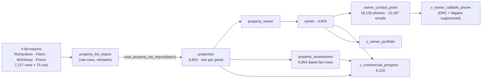

# 114 — DFW commercial property list: analysis, geoID fitness, and load

**Date:** 2026-09-29 · **Asked by:** Chris · **Status:** LOADED to prod (migrations 301 + 302, batch `dfw-commercial-2026-09-29`)
**Builds on:** [docs/113](113-property-spine.md) (property spine: one property = one APN/address = one geoid; owners link multi-parcel sites)

## 1. Does this data carry enough to use the geoID? Yes.

| County | Rows | Properties | APN format | geoID used | Parcel match |
|---|---|---|---|---|---|
| Collin (48085) | 6,764 | 6,402 | `R-3744-00A-001R-1` | **The APN itself.** It is exactly the Collin CAD `geoid`. | **6,205 of 6,402 (97%)** match a 2025 Collin CAD parcel; the other 197 are not in our 2025 roll (newer plats or accounts) and load as list-sourced parcels |
| Dallas (48113) | 243 | 243 | `26-00025-001-001-0000` | `48113-<normalized APN>` (docs/113 §1 mint rule) | No Dallas CAD file loaded |
| Denton (48121) | 210 | 209 | 6-character account id | `48121-<normalized APN>` | No Denton CAD file loaded |

Every row carries an APN and a county, so every row gets a geoID and none are skipped. 7,217 rows collapse to 6,854 properties: 305 APNs appear in two or more city files (the Richardson list includes Plano and Garland parcels). The list has **no latitude/longitude**, so `properties.geom` stays empty until geocoding. That point is needed for hail-swath matching.

## 2. Where every column went

| List columns | Destination |
|---|---|
| Address, Unit #, City, State, Zip, County, APN | `properties`: `address_full`, `unit`, `city`, `state`/`state_abbrev`, `zip`, `county`, `apn`, `apn_normalized`, `county_fips`, `geoid`, `address_key` |
| Property Type (+ CAD category) | `properties.property_class` / `property_type` / `type_source` via `property_type_from_sources()`. The vendor label is also kept on `property_assessment.vendor_property_type` |
| Owner Occupied | `properties.occupancy`, `property_owner.owner_occupied` |
| Owner 1 First / Last Name | `owner.first_name` / `last_name` / `display_name`; `owner_type` from `owner_type_from_name()` |
| Owner 2 First / Last Name | `property_owner.co_owner_name` (printed without its own mailing address and often truncated, so it is not yet its own owner) |
| Mailing Care of Name, Mailing Address / Unit / City / State / Zip / County | `owner.care_of_name`, `owner.mailing_*` |
| Litigator | `owner.is_tcpa_litigator` (sticky) |
| Do Not Mail | `owner.do_not_mail` (sticky) |
| Phone 1–5 + Type + DNC | `owner_contact_point` (`kind='phone'`, 10-digit `value`, `phone_line_type`, `dnc_status` sticky, `rank`) |
| Email 1–4 | `owner_contact_point` (`kind='email'`) |
| Bedrooms, Total Bathrooms, Building Sqft, Lot Size Sqft, Effective Year Built, Total Assessed Value, Last Sale date/amount, Open Loans count/balance, Est. Value / LTV / Equity, Lien Amount, MLS Status/Date/Amount | `property_assessment` (one row per property per source per date; `as_of` = Date Added to List) |
| Condition fields, Foreclosure Factor, Property Status, Notes, Marketing Lists/Campaigns, Voicemail Drops, Dialer, Postcards, E-Mails, Skip Traces, Method of Add | Kept only in `property_list_import.raw`. These are the list tool's own workflow counters, or near-empty (condition: 48 of 7,217 filled) |

## 3. What the list says about the market

| Measure | Value |
|---|---|
| Properties by type | commercial condo units 1,754 · commercial, sub-type unknown 4,264 (3,821 CAD `F1` + 443 generic vendor label) · vacant land 629 · restaurant 48 · shopping center 45 · retail 28 · auto 23 · hospitality 15 · education 13 · parking 12 · self-storage 9 · healthcare 4 · agricultural 1 · residential 9 |
| Commercial prospects (`v_commercial_prospect`, excludes land/residential) | 6,216 |
| Reachable (≥1 callable phone or an email) | 5,264 |
| Owners | 4,934; **803 own two or more parcels** (largest: McKinney Municipal Utility District No 1, 105) |
| Owner types | company 3,713 · individual 653 · other 343 · trust 146 · government 32 · religious 27 · HOA 20 |
| Phones | 18,135 distinct: **10,224 flagged Public DNC**, 7,911 clear; 7,344 dialable after removing litigator-owned numbers |
| Litigator-flagged owners | 323 (every phone suppressed) |
| Already an AccuLynx job at the same address | 11 properties (10 jobs) — existing customers |
| Already on the StormWatch commercial call list | 245 |
| On the residential `lead_list` | 0 |

**Update 2026-09-29 (docs/115):** 2,573 of the unknown sub-types were refined from Collin improvement class codes, the list is geocoded, and all 11 AccuLynx customers are linked.

**Two follow-ups raise the value of this list:**
- **Sub-type.** 4,264 properties are "commercial, sub-type unknown". Collin CAD carries `propusecode` and `imprvclasscd`, which can refine them into office, retail, warehouse and so on without a vendor.
- **Vacant land.** The 629 vacant parcels have no roof. They are held out of the prospect view but kept in the spine (a future building is still that parcel).

## 4. Compliance built into the read path

- `owner_contact_point.dnc_status`, `owner.is_tcpa_litigator` and `owner.do_not_mail` are **sticky**: a later list can set them but never clear them.
- `v_owner_callable_phone` is the only phone source a dialer should read. It drops DNC-flagged numbers and every number of a litigator-flagged owner. It is a suppression floor, not legal clearance: consent rules for automated calls to cell numbers still apply, and `do_not_mail` governs mail separately.
- All new tables, functions and views are service-role only (anon/authenticated revoked; verified live: anon receives `permission denied` on `owner`, `owner_contact_point`, `property_list_import`, `v_commercial_prospect`, `v_owner_callable_phone`).

## 5. How the CRM gets it

The CRM owns `crm` / `crm_private` / `crm_gateway`, and reads `public.properties` only through `crm_property_reader`'s 7-column grant (docs/110 §3, docs/111). That grant is unchanged, so **the CRM does not see the new fields yet**. The contract-compliant path: the CRM publishes a `crm_gateway` view over `public.v_commercial_prospect` (and `v_owner_callable_phone` for its dialer) granted to its own reader role. That is the CRM team's change; nothing in this load writes to CRM schemas.

## 6. Re-running and adding lists

The loader is idempotent and never overwrites values another source set. Re-running this batch inserted 0 properties and refreshed the rest. A new list in the same 75-column export format:

1. Stage its rows into `property_list_import` under a new `import_batch`, with the raw row as `raw` jsonb (as the 2026-09-29 staging did from the four files).
2. `SELECT public.load_property_list_import('<batch>');` and read the returned counts.
3. A county not in the loader's FIPS map (today Collin, Dallas, Denton, Tarrant, Rockwall) is skipped and counted, never guessed. Add the county to the map first. Sedgwick is deliberately excluded: its geoIDs use the `SGK-` form, and minting FIPS-APN would duplicate those parcels.
