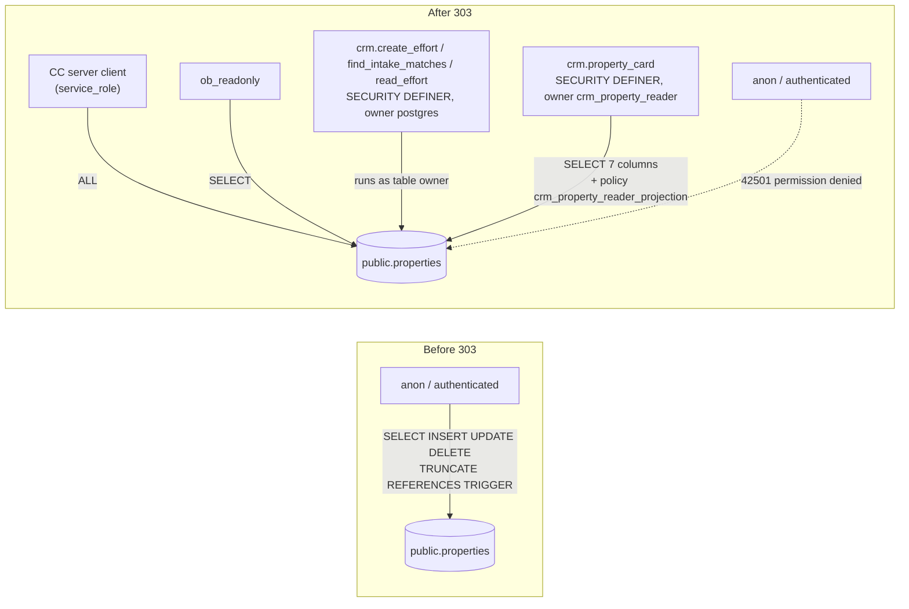

# 115 — `public.properties`: anon and authenticated lose every table privilege

**Date:** 2026-09-29 · **Migration:** [`303-properties-revoke-anon-authenticated.sql`](../schemas/cleverwork-roofer/303-properties-revoke-anon-authenticated.sql) (ledger `20260929122615 303_properties_revoke_anon_authenticated`) · **Status:** applied to prod `rnhmvcpsvtqjlffpsayu`; **CRM team confirmation pending** (docs/110 §3 — shared object, joint review)

## 1. Why

Measured 2026-09-29: `anon` and `authenticated` held `arwdDxtm` (every table privilege) on `public.properties` — Supabase's default grants on `public`, never narrowed. RLS is on with a single policy (`crm_property_reader_projection`, SELECT, role `crm_property_reader`), so row-level DML by those roles returned nothing. But **TRUNCATE is not subject to RLS**, REFERENCES/TRIGGER are object-level, and the remaining grants were one bad policy away from exposing the property spine (6,861 rows, including the 6,854 commercial parcels loaded by 302) to anyone holding the publishable key.

## 2. Who needs the table (verified live, not from migration files)

| Caller | Runs as | Needs anon/authenticated grant? |
|---|---|---|
| Command Center (`createServerSupabaseClient`, `app/command-center/src/lib/supabase.server.ts`) | `service_role` — it is the only Supabase client in the app; no CC code queries `properties` at all today | No |
| `crm.create_effort` (the CRM's only writer — INSERT + address-match SELECT) | SECURITY DEFINER, owner `postgres` (table owner, `search_path=pg_catalog`) | No |
| `crm.find_intake_matches`, `crm.read_effort` | SECURITY DEFINER, owner `postgres` | No |
| `crm.property_card` (the reader projection) | SECURITY DEFINER, owner `crm_property_reader`; column grant `(id, address_full, city, state, state_abbrev, zip, country)` + policy | No — both left untouched and re-asserted in 303 |
| CRM staff PostgREST requests | role `member`; `crm_gateway.api_pre_request` admits only `POST /rpc/*` with `Content-Profile: crm` | No — `member` holds nothing on `properties` |
| `ob_readonly` | SELECT | Kept |

## 3. Decision

`REVOKE ALL ON public.properties FROM anon, authenticated;` — not just TRUNCATE/TRIGGER/REFERENCES. No documented contract uses SELECT/INSERT/UPDATE/DELETE via those roles, and with no policy for them the grants only ever returned empty sets. Same shape as migration 300.

**Behaviour change to watch:** a direct PostgREST read of `properties` as anon/authenticated used to return `200 []`; it now returns `401 42501`. The same applies to an embedded resource (`?select=…,properties(*)`) from a table that is exposed to those roles. No caller in either repo is known to do this, which is what the CRM team is asked to confirm.

**Rollback:** `GRANT ALL ON public.properties TO anon, authenticated;` (restores the exact prior ACL).

## 4. Verification (2026-09-29, after apply)

- `relacl` = `{postgres=arwdDxtm, service_role=arwdDxtm, ob_readonly=r}`; `has_table_privilege` false for all seven privileges on `anon` and `authenticated`.
- `crm_property_reader` still has SELECT on the seven columns; the policy is present.
- As `anon`/`authenticated` in SQL: SELECT, INSERT and TRUNCATE all fail `42501`; row count unchanged at 6,861.
- Live PostgREST, publishable key **and** legacy anon JWT: GET/POST/DELETE `/rest/v1/properties` → `401 {"code":"42501"}`. Control `roof_system_category` still `200`.
- `crm.property_card(<real effort>)` called as `authenticated`: raises no permission error on `properties`. It returns `P0002 not_found` both with the post-303 ACL and with the pre-303 ACL temporarily restored inside a rolled-back transaction, so that result predates 303. Most likely cause: `crm.efforts` RLS resolves the actor from WorkOS JWT claims, and a bare SQL session has none. The CRM team should confirm with a real `member` request.

## 5. Open — not fixed here

**Owner-rights views over `properties` are still anon-readable.** Four views run as `postgres` (no `security_invoker`) and still carry `anon`/`authenticated` `arwdDxtm`, so they bypass both RLS and this migration. Measured as `anon` the same day:

| View | Rows anon can read |
|---|---|
| `vw_tracked_property` | 155,242 |
| `replacement_quote_ready` | 6,862 (property addresses — confirmed over live PostgREST with the publishable key) |
| `warranty_claim_ready` | 8 |
| `job_property_client_summary` | 3 |

These follow the migration 300 pattern (service-role-only) but are left out of 303 to keep this change to the one table the CRM shares. Follow-up: a separate migration revoking them after checking their readers. `v_commercial_prospect` and `v_owner_portfolio` (added by 301/302) are already service-role-only.

Inventory entry added to [docs/111](111-crm-pwa-companion-repo.md) (CRM changes to surfaces we own).
