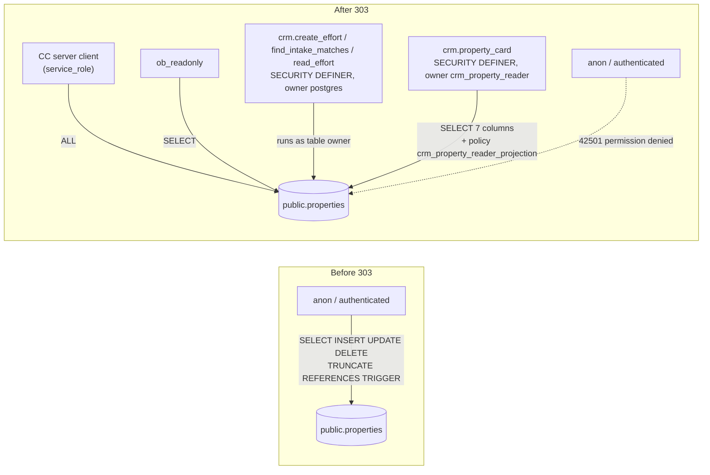

# 115 — `public.properties`: anon and authenticated lose every table privilege

**Date:** 2026-09-29 · **Migrations:** [`303-properties-revoke-anon-authenticated.sql`](../schemas/cleverwork-roofer/303-properties-revoke-anon-authenticated.sql) (ledger `20260929122615 303_properties_revoke_anon_authenticated`) + [`304`](../schemas/cleverwork-roofer/304-property-views-service-role-only.sql) and [`309`](../schemas/cleverwork-roofer/309-tracked-property-dependent-views-service-role-only.sql) for the owner-rights views (§5, §5a) · **Status:** applied to prod `rnhmvcpsvtqjlffpsayu`; **CRM team confirmation pending** (docs/110 §3 — shared object, joint review)

## 1. Why

Measured 2026-09-29: `anon` and `authenticated` held `arwdDxtm` (every table privilege) on `public.properties` — Supabase's default grants on `public`, never narrowed. RLS is on with a single policy (`crm_property_reader_projection`, SELECT, role `crm_property_reader`), so row-level DML by those roles returned nothing. But **TRUNCATE is not subject to RLS**, REFERENCES/TRIGGER are object-level, and the remaining grants were one bad policy away from exposing the property spine (6,861 rows, including the 6,854 commercial parcels loaded by 302) to anyone holding the publishable key.

## 2. Who needs the table (verified live, not from migration files)

| Caller | Runs as | Needs anon/authenticated grant? |
|---|---|---|
| Command Center (`createServerSupabaseClient`, `app/command-center/src/lib/supabase.server.ts`) | `service_role` — it is the only Supabase client in the app; no CC code queries `properties` at all today | No |
| `crm.create_effort` (the CRM's only writer — INSERT + address-match SELECT) | SECURITY DEFINER, owner `postgres` (table owner, `search_path=pg_catalog`) | No |
| `crm.find_intake_matches`, `crm.read_effort` | SECURITY DEFINER, owner `postgres` | No |
| `crm.property_card` (the reader projection) | SECURITY DEFINER, owner `crm_property_reader`; column grant `(id, address_full, city, state, state_abbrev, zip, country)` + policy | No — both left untouched and re-asserted in 303 |
| CRM staff PostgREST requests | role `member`; `crm_gateway.api_pre_request` admits only `POST /rpc/*` with `Content-Profile: crm` | No — `member` holds nothing on `properties` |
| `ob_readonly` | SELECT | Kept |

## 3. Decision

`REVOKE ALL ON public.properties FROM anon, authenticated;` — not just TRUNCATE/TRIGGER/REFERENCES. No documented contract uses SELECT/INSERT/UPDATE/DELETE via those roles, and with no policy for them the grants only ever returned empty sets. Same shape as migration 300.

**Behaviour change to watch:** a direct PostgREST read of `properties` as anon/authenticated used to return `200 []`; it now returns `401 42501`. The same applies to an embedded resource (`?select=…,properties(*)`) from a table that is exposed to those roles. No caller in either repo is known to do this, which is what the CRM team is asked to confirm.

**Rollback:** `GRANT ALL ON public.properties TO anon, authenticated;` (restores the exact prior ACL).

## 4. Verification (2026-09-29, after apply)

- `relacl` = `{postgres=arwdDxtm, service_role=arwdDxtm, ob_readonly=r}`; `has_table_privilege` false for all seven privileges on `anon` and `authenticated`.
- `crm_property_reader` still has SELECT on the seven columns; the policy is present.
- As `anon`/`authenticated` in SQL: SELECT, INSERT and TRUNCATE all fail `42501`; row count unchanged at 6,861.
- Live PostgREST, publishable key **and** legacy anon JWT: GET/POST/DELETE `/rest/v1/properties` → `401 {"code":"42501"}`. Control `roof_system_category` still `200`.
- `crm.property_card(<real effort>)` called as `authenticated`: raises no permission error on `properties`. It returns `P0002 not_found` both with the post-303 ACL and with the pre-303 ACL temporarily restored inside a rolled-back transaction, so that result predates 303. Most likely cause: `crm.efforts` RLS resolves the actor from WorkOS JWT claims, and a bare SQL session has none. The CRM team should confirm with a real `member` request.

## 5. Owner-rights views over `properties` — closed by migration 304

**Migration:** [`304-property-views-service-role-only.sql`](../schemas/cleverwork-roofer/304-property-views-service-role-only.sql) (ledger `20260929124034 304_property_views_service_role_only`) · **Status:** applied to prod 2026-09-29.

Four views are owned by `postgres`, with no `security_invoker`, and carried `anon`/`authenticated` `arwdDxtm`. A view runs as its owner, so they bypassed both RLS and 303. Measured as `anon` before 304:

| View | Rows anon could read | After 304 |
|---|---|---|
| `vw_tracked_property` | 155,242 | `401 42501` |
| `replacement_quote_ready` | 6,862 (property addresses, confirmed over live PostgREST with the publishable key) | `401 42501` |
| `warranty_claim_ready` | 8 | `401 42501` |
| `job_property_client_summary` | 3 | `401 42501` |

**Readers (checked before revoking, 2026-09-29):**

| Where | Finding |
|---|---|
| Command Center, `scripts/`, `integrations/`, agents | No reader. None of the four names appears in any file on any branch of this repo. The app's only Supabase client is `createServerSupabaseClient` (`app/command-center/src/lib/supabase.server.ts`, service role). |
| CRM (docs/110, docs/111) | No reader. None of the four names appears on any branch of `Clvrwrk/CRM_PWA`. CRM staff requests run as `member`, which holds nothing on these views. |
| Database | No function body names them; no `pg_cron` job touches them. |
| PostgREST edge logs, last 24 h | One request: the 303 session's own `curl` probe. |
| Dependent views | `vw_tracked_property` feeds `vw_call_list`, `vw_hail_heatzone_coverage` and `vw_zip_impact_coverage`. All three are owned by `postgres`, and a view checks its underlying relations as its owner, so 304 does not affect them. The CC reads `vw_hail_heatzone_coverage` through the service-role client (`live-work.ts`), and it still returns rows after 304. |

**Decision:** same shape as migration 300. `REVOKE ALL … FROM anon, authenticated`, explicit `GRANT SELECT` to `service_role`, and `ob_readonly` keeps SELECT.

**Verification (after apply):**
- `relacl` on each view = `{postgres=arwdDxtm, service_role=arwdDxtm, ob_readonly=r}`. `has_table_privilege` is false for all seven privileges for `anon` and `authenticated` on all four views. `ob_readonly` holds SELECT only.
- In SQL, `SET ROLE anon` / `authenticated` then `SELECT … LIMIT 1` fails with `42501` on all 8 role×view pairs. As `service_role`, all four views return rows (8 and 3 for the two small ones, unchanged), and so does the dependent `vw_hail_heatzone_coverage`.
- Live PostgREST, publishable key **and** legacy anon JWT: `GET /rest/v1/<view>?limit=1` → `401 {"code":"42501"}` for all four. The control `roof_system_category` still returns `200`.

**Rollback:** `GRANT ALL ON public.<view> TO anon, authenticated;` per view. This restores the exact prior ACL.

### 5a. The dependent views — closed by migration 309

**Migration:** [`309-tracked-property-dependent-views-service-role-only.sql`](../schemas/cleverwork-roofer/309-tracked-property-dependent-views-service-role-only.sql) (ledger `20260929160408 309_tracked_property_dependent_views_service_role_only`) · **Status:** applied to prod 2026-09-29. It is numbered 309 because PR #18 (property spine) holds files 305–308.

304 narrowed the leak but did not close it. Five views sit on `vw_tracked_property`. All are owned by `postgres` with no `security_invoker`, and each carried `anon`/`authenticated` `arwdDxtm`, so they still served its data to the publishable key after 304. A recursive `pg_depend` walk finds nothing further built on them.

| View | Built on | anon after 304 | After 309 |
|---|---|---|---|
| `vw_zip_impact_coverage` | `vw_tracked_property` | returned rows | `401 42501` |
| `vw_hail_heatzone_coverage` | `vw_tracked_property`, `vw_zip_impact_coverage` | returned rows | `401 42501` |
| `vw_call_list` | `vw_tracked_property`, `vw_zip_impact_coverage` | returned rows | `401 42501` |
| `vw_call_priority` | `vw_call_list` | SELECT granted | `401 42501` |
| `vw_property_enhancement_request` | `vw_zip_impact_coverage` | SELECT granted | `401 42501` |

**Readers (checked before revoking, 2026-09-29):**

| Where | Finding |
|---|---|
| Command Center | Only `vw_hail_heatzone_coverage`, in `loadMarketingSurface` (`app/command-center/src/lib/live-work.ts`), using the client from `createServerSupabaseClient` (service role). No other file on any branch names any of the five outside docs and SQL. |
| CRM | No reader on any branch of `Clvrwrk/CRM_PWA`. |
| Database | No function body and no `pg_cron` job references them. |
| PostgREST edge logs, last 24 h | 93 requests, all to `vw_hail_heatzone_coverage`. Every one had apikey role **and** authorization role `service_role`, came from the Hetzner hosts and used `supabase-js` on Node. No `anon` or `authenticated` request. |

**Verification (after apply):**
- `relacl` on each view = `{postgres=arwdDxtm, service_role=arwdDxtm, ob_readonly=r}`. `anon` and `authenticated` hold none of the seven privileges on any of the five views. `ob_readonly` holds SELECT only.
- In SQL: `42501` on all 10 role×view pairs. As `service_role`, all five return rows, including the CC's exact query shape on `vw_hail_heatzone_coverage` (50 rows).
- Live PostgREST, publishable key and legacy anon JWT: `401 {"code":"42501"}` on all five. The control `roof_system_category` still returns `200`.

**Rollback:** `GRANT ALL ON public.<view> TO anon, authenticated;` per view.

**The CC's timeouts — fixed by migration 310.** Most of the CC's `vw_hail_heatzone_coverage` reads were failing before 309 (`HEAD` counts → `500`, some `504`). `loadMarketingSurface` fired three full recomputes at once (3.4 s each, warm), and together they passed PostgREST's 8 s `statement_timeout`. That was a speed problem, not a grant problem. [`310-materialised-hail-heatzone-coverage.sql`](../schemas/cleverwork-roofer/310-materialised-hail-heatzone-coverage.sql) (ledger `20260929173610 310_materialised_hail_heatzone_coverage`) adds `mv_hail_heatzone_coverage`, keyed on `zcta_geoid`. `pg_cron` job `refresh-hail-heatzone-coverage` refreshes it `CONCURRENTLY` at 12, 27, 42 and 57 past the hour (2.3 s). It is service-role and `ob_readonly` only; a matview has no RLS, so granting `anon` would reopen what 309 closed. `live-work.ts` now reads the matview (3–5 ms per read). `sourceTable` stays `vw_hail_heatzone_coverage` because `dashboard_action_log` stores it. The matview matched the view row-for-row at creation (`EXCEPT` both ways = 0).

`v_commercial_prospect` and `v_owner_portfolio` (301/302) are already service-role-only.

Inventory entry added to [docs/111](111-crm-pwa-companion-repo.md) (CRM changes to surfaces we own).
