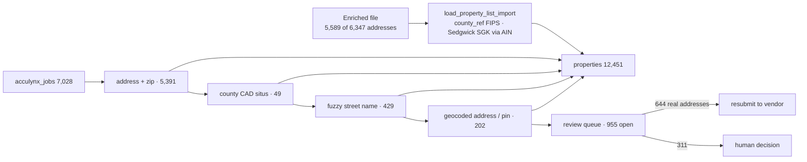

# 116 — AccuLynx enrichment round trip: load, link, geocode, review

**Date:** 2026-09-29 · **Asked by:** Chris · **Status:** LOADED to prod (migrations 305–308, batch `acculynx-enriched-2026-09-29`)
**Builds on:** [docs/113](113-property-spine.md) (property spine) · [docs/114](114-dfw-commercial-property-list.md) (list loader)

## 1. What came back

The vendor returned **5,589 of the 6,347** addresses sent (docs/113 §4). It returned them in the list tool's own 75-column format, so the `Ref ID` and `FIPS` columns were gone. Two consequences:

- **Jobs match back by address, not Ref ID.** Normalized street + zip first, then county CAD situs, then street-name similarity, then the geocoder's standardized address (§3).
- **County FIPS comes from `county_ref`**, loaded from the Census Bureau's public `national_county2020.txt` (3,235 counties). The download was approved by Chris; the loader is `scripts/load-county-ref.py`. Matching is by state + normalized county name (`county_key()`: punctuation stripped, `SAINT` → `ST`, county/parish suffix dropped). Only Hampton, VA (an independent city) did not resolve.

Sedgwick County rows carry the Kansas parcel number (`214-20-0-43-04-030.00`). Its digits are the Sedgwick `ain`, so **925 rows resolved to their existing `SGK-` geoIDs** instead of minting duplicates. 146 minted `20173-<APN>` because their AIN is not in our 2024 Sedgwick file.

## 2. Every field now has a column

The 75 list columns are all typed now. Migration 305 added what docs/114 had left in `raw`:

| Fields | Now in |
|---|---|
| Total / Interior / Exterior / Bathroom / Kitchen Condition, Foreclosure Factor, Property Status, Notes | `property_assessment` |
| Marketing Lists, Marketing Campaigns, Voicemail Drops, Dialer, Postcards, E-Mails, Skip Traces, Date Added to List, Method of Add | `property_list_import` (typed columns beside `raw`) |
| Mailing County | `owner.mailing_county` (now filled on update too) |

The residential vocabulary (single-family, townhouse, condominium, duplex/triplex, apartments, mobile home, rural residence, …) now maps into `property_type_from_sources()`. Migration 305 added one type, `multifamily_unspecified`, for "Multi-Family Dwellings (Generic, 2+)", which gives no unit count.

**Next enrichment, start to finish:** `scripts/stage-property-list.py <batch> <file.xlsx>` → `SELECT load_property_list_import('<batch>');` → `SELECT link_acculynx_jobs_to_properties();` → `SELECT link_acculynx_jobs_via_geocode();` → `SELECT refresh_acculynx_job_property_review();`

## 3. Job → property links

| Step | Method (`acculynx_jobs.property_link_method`) | Confidence | Jobs |
|---|---|---|---|
| Normalized street + zip, one property | `address_zip` | 0.95 | 5,391 |
| Collin CAD situs (property created from the parcel) | `collin_cad_situs` | 0.90 | 23 |
| Sedgwick CAD situs (property created from the parcel) | `sedgwick_cad_situs` | 0.90 | 26 |
| Same zip + house number, street-name similarity ≥ 0.6, one candidate | `address_fuzzy` | 0.80 | 429 |
| Google standardized address = one property | `geocode_address` | 0.85 | 124 |
| Google pin within 30 m of one property, same house number | `geocode_proximity` | 0.85 | 78 |
| Pre-existing | (null) | — | 2 |
| **Linked** | | | **6,073 of 7,028 (86%)** |

The 0.6 similarity bar was calibrated on the unlinked jobs: every sampled pair at or above it was a true match ("SCHALIMAR DR" / "SHALIMAR DR", "SEVEN LAKES BLVD" / "7 LAKES BLVD"). Below it, real matches mix with different streets ("ELLIS ST" / "ELLIS AVE"), so those go to people. All links are `evidence` grade. The `fuzzy_links_check` sheet lists the 429 fuzzy links for spot-checking.

Links survive the AccuLynx sync: `supabase/functions/acculynx-sync` upserts a fixed column list that includes neither `property_id` nor the link columns.

**AccuLynx data errors found:** 100 linked jobs carry the wrong zip in AccuLynx (for example Frisco addresses entered as 75034 that are 75033). Each is recorded in the review row's `resolution` and listed on the `acculynx_zip_fixes` sheet.

**Commercial list customers (docs/114):** all 11 commercial-list properties with an AccuLynx job at the same address are now linked.

## 4. The review queue (`acculynx_job_property_review`)

955 jobs remain. Every one has a reason, a recommended action, and (where it has a street) a Google geocode verdict:

| Recommended action | Jobs | Meaning |
|---|---|---|
| `resubmit_for_enrichment` | 644 | Google pins the address precisely (rooftop or street range), but the vendor returned nothing. These are the "~600 errors". The `resubmit_enrichment` sheet has them in the enrichment template with Google's standardized address, county and FIPS (544 unique addresses). |
| `fix_address_in_acculynx` | 283 | No street (74), no house number (24), no zip (2), or an address Google cannot pin (183). It needs a person to correct the AccuLynx job, or confirm it is not a property. |
| `confirm_suggested_match` | 26 | A likely property with a weak street-name match. Confirm or correct. |
| `choose_property` | 2 | Several properties at one street address (units). Pick one. |

The workbook is produced by `scripts/export-property-review.py`. It reads only, and can be re-run at any time. The queue is self-maintaining: `refresh_acculynx_job_property_review()` closes rows whose job has since linked (for example after an address is fixed in AccuLynx and the sync pulls it), and re-classifies the rest.

## 5. Sub-types and geocodes

- **Collin sub-type refinement:** 2,573 "commercial, sub-type unknown" properties refined from the Collin improvement class code (`imprvclasscd`), decoded from the Collin CAD class list published on taxnetusa.com/texas/collin. Leading refinements: retail 589, industrial/warehouse 486, restaurant 352, auto 258, office 197, shopping center 159. **1,829 remain unknown.** Their class code is absent, or has no published meaning (AH, CR, PE, GC, FH, TE), or the property is outside Collin.
- **Geocoding** (`properties.geom`, PostGIS point):

  | Source | Result | Properties |
  |---|---|---|
  | The linked AccuLynx job's pin (non-zero, inside the U.S.) | free | 5,268 |
  | Google, rooftop or street range | `ok` | 6,026 |
  | Google, approximate or partial | `low_precision` | 998 |
  | Google, nothing found | `no_result` | 1 |
  | Parcel-only labels ("Parcel R-…"), not sent | — | 158 |

  8,108 Google calls in total (7,025 properties + 1,083 review jobs), kept in `geocode_result`. `scripts/geocode-properties.py` is resumable and skips anything already geocoded with the same query.

## 6. Still open

- Send the `resubmit_enrichment` sheet to the vendor. Stage and load the answer as a new batch. Then run the §2 sequence; the review rows close themselves.
- Human decisions on the 311 `human_review` rows. Recording them back into the queue (`status`, `resolution`, `resolved_property_id`) is manual for now; a Command Center surface for it is the natural next step.
- Correct the 100 AccuLynx zips at the source.
- 1,829 commercial properties still need a sub-type (Dallas/Denton/other-county parcel data, or a human).
