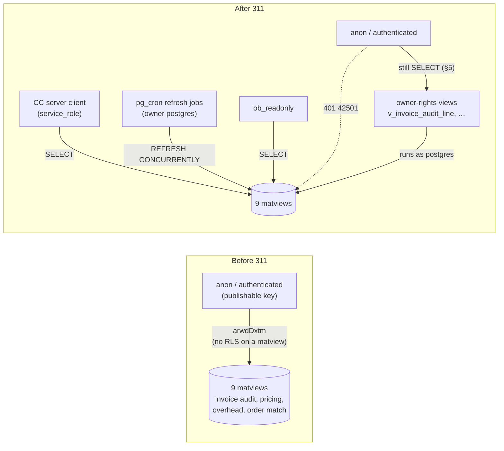
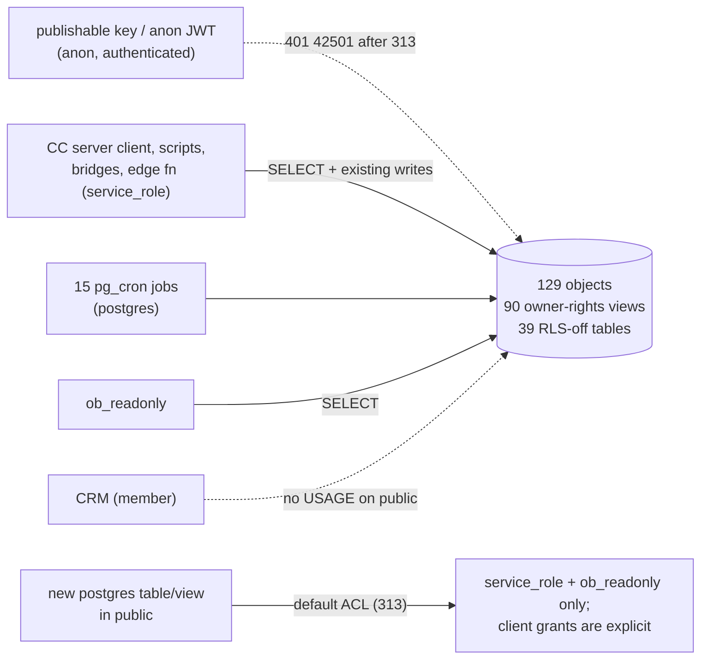

# 117 — Materialised views in `public`: service_role only

**Date:** 2026-09-29 · **Migrations:** [`311-matviews-service-role-only.sql`](../schemas/cleverwork-roofer/311-matviews-service-role-only.sql) (ledger `20260929174626 311_matviews_service_role_only`), [`313-public-owner-rights-views-and-rls-off-tables-service-role-only.sql`](../schemas/cleverwork-roofer/313-public-owner-rights-views-and-rls-off-tables-service-role-only.sql) (ledger `20260929190215 312_public_owner_rights_views_and_rls_off_tables_service_role_only`, §6–§8) · **Status:** both applied to prod `rnhmvcpsvtqjlffpsayu` · **Series:** follows [docs/115](115-properties-grant-lockdown.md) (303, 304, 309, 310)

> Two docs share the number 117: this one (grant lockdown, PR #20 and #23) and [117-property-review-screen.md](117-property-review-screen.md) (PR #22). Both claimed it on 2026-09-29. Cite this one by its full filename.

## 1. Why

A materialised view has no row-level security. Every matview in `public` created before 310 kept the schema's default grants (`anon=arwdDxtm`, `authenticated=arwdDxtm`), and migration 288 added an explicit `grant select … to anon, authenticated` on `mv_order_acculynx_match`. PostgREST served them to anyone holding the publishable key, which ships in client bundles by design.

Measured 2026-09-29 before 311, `GET /rest/v1/<mv>?limit=1` with the publishable key **and** the legacy anon JWT:

| Matview | What it holds | anon before 311 | After 311 |
|---|---|---|---|
| `mv_invoice_audit_line` | every audited invoice line, negotiated vs billed price | `200`, rows | `401 42501` |
| `mv_invoice_pricing_office` | invoice → PE office resolution | `200`, rows | `401 42501` |
| `mv_office_agreement_versions` | agreement versions per office | `200`, rows | `401 42501` |
| `mv_vendor_office_item_history` | purchase history per vendor/office/item | `200`, rows | `401 42501` |
| `mv_order_acculynx_match` | orders ↔ AccuLynx jobs, client names | `200`, rows | `401 42501` |
| `mv_overhead_account_month` | overhead and COGS actuals by account and month | `200`, rows | `401 42501` |
| `product_vendor_pricing` | purchase-price rollup | `200`, rows | `401 42501` |
| `product_vendor_branch_pricing` | purchase-price rollup by branch | `200`, rows | `401 42501` |
| `mv_invoice_audit_summary` | (not populated) | `500 55000`, grant present | `401 42501` |

`mv_hail_heatzone_coverage` (310) was created service-role + `ob_readonly` only and was already `401`.

## 2. Who reads them (verified live, not from migration files)

| Where | Finding |
|---|---|
| Command Center | Every reader uses `createServerSupabaseClient` (`app/command-center/src/lib/supabase.server.ts`, `SUPABASE_SERVICE_ROLE_KEY`): `invoice-audit.ts`, `credit-memo.ts`, `fixed-costs.ts`, `order-audit.ts`, `price-agreement-management.ts`, `accounting/credit-memos/sent.astro`, `api/credit-memos/{add-line,review-line}.ts`, `api/invoice-audit/classify.ts`, `api/price-agreement/review/promote.ts`, `api/vendor-territories/assign.ts`. No browser client and no anon key in app code. |
| `scripts/`, `integrations/`, `agents/` | No file on any origin branch names a matview. The two callers of `rpc/alex_no_price_triage` (invoker-rights, reads `mv_invoice_pricing_office` and `mv_office_agreement_versions`) are `scripts/alex-no-price-triage.mjs` and `integrations/bridges/ingest-vendor-invoice-csv.mjs`, both service role. |
| CRM (`Clvrwrk/CRM_PWA`, 120 refs) | No match on any branch. CRM requests run as role `member` ([docs/111](111-crm-pwa-companion-repo.md)); `member` is a member of no other role and was never in these ACLs, so 311 does not change what it can read. |
| Database | Refresh jobs `pvp_refresh_nightly`, `refresh-office-pricing-matviews`, `refresh-order-acculynx-match` and `refresh-overhead-matview` run as `postgres`, the owner. `REFRESH` needs ownership, not grants. `service_pending_matview_refreshes` is `SECURITY DEFINER` owned by `postgres`. `credit_memo_claims_sync` is invoker-rights but is reached only from the `postgres` cron job. |
| PostgREST edge logs, last 24 h | 365 requests to the matviews plus 1 to `rpc/alex_no_price_triage`. Every one had apikey role **and** authorization role `service_role`, from the Coolify host (`178.105.220.14`, supabase-js on Node) or the Hetzner agent host. No `anon` or `authenticated` request. |

## 3. Decision

Same shape as 300, 304 and 309: `REVOKE ALL … FROM anon, authenticated`, explicit `GRANT SELECT … TO service_role`, keep `ob_readonly` SELECT. GRANT/REVOKE only. The migration is additive and idempotent (hard rule 1) and safe to re-run. `SET LOCAL lock_timeout = '10s'` guards against a collision with the 15-minute refresh. It was applied between runs.

**Rule going forward:** a new matview in `public` is created with `REVOKE ALL … FROM anon, authenticated` in the same migration, the way 310 does. A matview has no RLS, so a default grant exposes every row.

Migration 288's explicit anon grant stays in the file (it is history in the ledger). Replaying the schema in order still ends revoked, because 311 runs after it.

## 4. Verification (2026-09-29, after apply)

- `relacl` on all ten matviews is `{postgres=arwdDxtm, service_role=arwdDxtm, ob_readonly=r}`. `has_table_privilege` is false for `anon` and `authenticated` on SELECT and on every write privilege.
- SQL, `SET LOCAL ROLE` per matview: `42501` on all 18 anon/authenticated × matview pairs. `service_role` reads all eight populated matviews. `mv_invoice_audit_summary` fails only on `55000`, as it did before.
- Live PostgREST, publishable key and legacy anon JWT: `401 {"code":"42501"}` on all nine (and on `mv_hail_heatzone_coverage`). An anon `DELETE` also returns `401`.

### 4a. Live call path and refresh jobs

- **Command Center, production (edge logs 17:46–18:02 UTC):** from the Coolify host `178.105.220.14`, authorization role `service_role`, `mv_invoice_audit_line` returned `200` 12 times and `mv_order_acculynx_match` `200` 4 times after 311. The only `401`s in the window are the verification probes in §4.
- **Refresh jobs (`cron.job_run_details`):** `refresh-order-acculynx-match` succeeded at 17:52 (0.5 s). `refresh-office-pricing-matviews` succeeded at 18:00 (72 s; it refreshes `mv_office_agreement_versions`, `mv_invoice_pricing_office`, `mv_vendor_office_item_history` and `mv_invoice_audit_line`, then runs the CM sync and reconcile). `pvp_refresh_nightly` and `refresh-overhead-matview` run at 07:00 and 07:35 UTC. Both run as the same owner (`postgres`) as the jobs above, so grants do not affect them.

## 5. Not closed by 311: owner-rights views over these matviews

> **Closed by 313 (2026-09-29, §6).** The text below is the state after 311 and is kept as the record.

311 closes direct matview access. It does **not** close the data. Eleven `postgres`-owned views without `security_invoker` read these matviews and still carry the default anon/authenticated grants. A view checks the relations it reads as its owner, so they still serve the same rows to the publishable key:

`v_inv_processed_weekly`, `v_invoice_audit_invoice`, `v_invoice_audit_line`, `v_invoice_audit_line_cascade`, `v_no_price_repeats`, `v_office_vendor_agreement_coverage`, `v_order_audit_line`, `v_order_audit_order`, `v_price_seed_item`, `v_top20_negotiation_dashboard`, `v_vendor_office_item_history`. (`v_office_vendor_gap_exposure` and `v_runtime_feed_freshness` are already locked.) Measured after 311 with the publishable key: `v_vendor_office_item_history`, `v_top20_negotiation_dashboard`, `v_office_vendor_agreement_coverage`, `v_order_audit_order` and `v_inv_processed_weekly` each returned `200` with a row.

These views belong to a wider class. On 2026-09-29, `public` has **90** `postgres`-owned views without `security_invoker` that anon can SELECT, and **40** tables that anon can SELECT with RLS off. The durable fix is a schema-wide pass: find readers per object as in §2, revoke, and change the `public` default privileges so new objects stop inheriting `anon`/`authenticated` grants. That is the next migration in this series. It is out of scope here because the reader audit is per object and the CRM may depend on some of them.

**Rollback (311):** the `GRANT ALL … TO anon, authenticated` lines in the 311 header, one per matview.

## 6. Migration 313: owner-rights views and RLS-off tables in `public`

### 6.1 Scope and exposure (measured 2026-09-29, before 313)

Enumerated live from `pg_class.relacl` and `has_table_privilege('anon', oid, 'SELECT')` in schema `public`:

| Class | Count | ACL before |
|---|---|---|
| Views owned by `postgres`, no `security_invoker` | 90 | `{postgres,anon,authenticated,service_role}=arwdDxtm, ob_readonly=r` |
| Tables with RLS off, owned by `postgres` | 39 | same |
| Extension-owned (`spatial_ref_sys`, `geography_columns`, `geometry_columns`, owner `supabase_admin`) | 3 | not touched (§8) |

Every one of the 129 objects had the same ACL, so the rollback is exact. `GET /rest/v1/<obj>?limit=1` with the publishable key: **114** returned a row, **5** returned `[]` (grant present, relation empty), **10** hit the anon statement timeout (`500 57014`, grant present). The eleven views named in §5 are all in the set.

### 6.2 Who reads them (verified live, not from migration files)

| Where | Finding |
|---|---|
| Command Center | Every reader in `app/command-center` on every origin branch uses `createServerSupabaseClient` (service role). The only publishable-key client in app code is the CRM sales proxy (`api/sales/[...path].ts`, `crm-access.server.ts` on `companion/cc-sales-2026-09` and the archived CRM branch), which dispatches CRM RPCs and names none of the 129. |
| `scripts/`, `integrations/`, `supabase/functions/`, `deployment/`, `agents/` (42 origin branches) | Readers: `abc-nightly-sync.sh`, `alex-no-price-triage.mjs`, `build-inv-processed-weekly.mjs`, `site-quality-sweep.mjs`, `invoice-audit-v2/*`, `abc-supply/{backfill-invoice-pdfs,fetch-product-images,fill-open-invoice-api-prices,price-seed}.mjs`, `acculynx-reconcile-check.sql`, edge function `acculynx-sync`. All use `SUPABASE_SERVICE_ROLE_KEY` or `psql` as `postgres`. `agents/profiles/maya-chen.yaml` and the Maya listener name `v_item_uom_map` only in prompt text. **62** of the 129 have no code reader at all. |
| CRM (`Clvrwrk/CRM_PWA`, 120 refs) | No code reader on any branch. Four objects (`property_profile`, `v_13wcf_undated_pool`, `v_cash_position`, `v_qb_export_pending`) are named in `docs/delivery/*` only, as analysis of this repo's schema. CRM requests run as `member`, which has **no USAGE on schema `public`**. No `crm*` function, RLS policy, or view references any of the 129. **Nothing here is a joint decision under [docs/110 §3](110-cc-crm-boundary-and-live-branch.md).** |
| Database | All 15 `pg_cron` jobs run as `postgres`. No `security_invoker` view, non-`postgres` view, RLS policy or realtime publication depends on the 129. Fifteen invoker-rights functions read them (last column of the per-object table); every one is reached only from `postgres` cron or a service-role caller, which keep access. |
| PostgREST edge logs, last 24 h (`query_logs`, `source='edge_logs'`, grouped by `request.sb.jwt.authorization.payload.role`) | **2,324** requests to the 129, all `service_role`, from the Coolify host (`178.105.220.14`) and PE-US-AGENTS (`178.156.203.23`). The only anon or publishable-key requests came from this workstation (`50.20.123.69`): the verification probes of 115/117. The other non-JWT traffic is `sb_secret_*` (the `acculynx-sync` edge function, service level) and CRM RPCs (`rpc/get_session`, `rpc/list_efforts`, …) from the Coolify host with the publishable key. No `authenticated` or `member` request touched the 129. |

Per-object table (129 rows): anon exposure before 313, code readers, invoker-rights DB readers

| Object | Kind | Anon GET before 313 | Code readers (all service role) | Invoker-rights DB readers (postgres / service_role callers) |
|---|---|---|---|---|
| `_backup_abc_regions_20260605` | table | `200`, row | — | — |
| `_backup_abc_vendor_branches_20260605` | table | `200`, row | — | — |
| `abc_invoice_ar_import` | table | `200`, row | — | — |
| `abc_invoice_ar_line_import` | table | `200`, row | — | — |
| `abc_invoices_quarantine` | table | `200`, row | — | — |
| `abc_price_list_pdf_import` | table | `200`, row | — | ingest_price_list_observations() |
| `agreement_gap_queue` | table | `200`, row | CC app, abc-nightly-sync.sh, alex-no-price-triage.mjs | alex_no_price_triage() |
| `agreement_package_items` | table | `200`, row | CC app | — |
| `agreement_package_submissions` | table | `200`, `[]` | CC app | — |
| `agreement_packages` | table | `200`, row | CC app | — |
| `credit_memo_receipts` | table | `200`, row | CC app | credit_memo_reconcile(), credit_memo_reconcile_correct_links() |
| `crm_pipeline_leadstage_orphan_quarantine` | table | `200`, row | — | — |
| `crm_pipeline_merged` | view | `200`, row | — | — |
| `crm_pipeline_orphan_quarantine` | table | `200`, row | — | — |
| `estimate_audit_edits` | table | `200`, row | CC app | — |
| `fixed_cost_register` | table | `200`, row | CC app | — |
| `fleet_baselines` | view | `200`, row | — | — |
| `fleet_data_gaps` | view | `200`, row | CC app | — |
| `fleet_driver_scorecard` | view | `200`, row | — | — |
| `fleet_fuel_monthly` | view | `200`, row | — | — |
| `frequently_ordered_import` | table | `200`, row | CC app, fetch-product-images.mjs, price-seed.mjs | — |
| `frequently_ordered_office_map` | table | `200`, row | — | — |
| `invoice_line_reaudit` | table | `200`, row | CC app, generate-credit-memo-packet.mjs, wave-b-reaudit.sql, site-quality-sweep.mjs | credit_memo_claims_sync(), invoice_audit_reset(), vendor_line_relink() |
| `invoice_pipeline_status` | table | `200`, row | CC app, link-vendor-invoice-pdfs.mjs, wave-a-register-gap.sql, wave-b-reaudit.sql | invoice_audit_process_stamp(), invoice_audit_reset() |
| `invoice_register_export` | table | `200`, row | CC app, build-inv-processed-weekly.mjs | — |
| `item_roof_system_category` | table | `200`, `[]` | — | — |
| `marketing_dashboard` | view | `500` 57014 | — | — |
| `matview_refresh_request` | table | `200`, row | CC app | — |
| `monday_invoice_queue` | table | `200`, row | — | — |
| `oem_product_reference` | table | `200`, row | — | — |
| `office_vendor_agreement_status` | table | `200`, row | CC app | — |
| `price_agreement_item_candidates` | table | `200`, row | — | stamp_candidate_office_evidence() |
| `price_agreement_proposals` | table | `200`, row | CC app | — |
| `price_agreement_requests` | table | `200`, row | CC app | — |
| `product_color_term` | table | `200`, row | — | vendor_desc_color_key() (called by v_invoice_audit_line) |
| `product_match_candidate` | table | `200`, row | CC app | — |
| `property_enrichment` | view | `200`, row | — | — |
| `property_profile` | view | `200`, row | — | — |
| `qb_bank_export_log` | table | `200`, row | CC app | — |
| `roof_system_category` | table | `200`, row | CC app | — |
| `service_warranty_audit_queue` | table | `200`, row | CC app | — |
| `v_13wcf_receipts_week` | view | `200`, row | CC app | — |
| `v_13wcf_undated_pool` | view | `200`, row | CC app | — |
| `v_abc_2026_ap_register` | view | `200`, row | — | — |
| `v_abc_catalog_review_due` | view | `200`, row | — | — |
| `v_abc_invoice_lines_with_pdf` | view | `200`, row | — | — |
| `v_abc_price_review_due` | view | `200`, row | — | — |
| `v_abc_review_summary` | view | `500` 57014 | — | — |
| `v_acculynx_cron_outcomes` | view | `200`, row | CC app, edge fn acculynx-sync | — |
| `v_acculynx_duplicate_guids` | view | `500` 57014 | — | — |
| `v_acculynx_null_provenance` | view | `200`, `[]` | — | — |
| `v_acculynx_orphan_subresources` | view | `500` 57014 | — | — |
| `v_acculynx_reconciliation` | view | `200`, row | acculynx-reconcile-check.sql, edge fn acculynx-sync | — |
| `v_acculynx_stale_tail` | view | `200`, row | — | — |
| `v_agreement_version` | view | `200`, row | — | — |
| `v_agreement_version_delta` | view | `200`, row | — | refresh_agreement_version_review() |
| `v_audit_2026` | view | `200`, row | — | — |
| `v_best_vendor_price` | view | `200`, row | — | — |
| `v_branch_item_api_price` | view | `200`, row | CC app, fill-open-invoice-api-prices.mjs | — |
| `v_branch_item_spend` | view | `200`, row | CC app | — |
| `v_branch_price_list` | view | `200`, row | CC app | — |
| `v_cash_position` | view | `200`, row | CC app | — |
| `v_communication_event_timeline` | view | `200`, row | — | — |
| `v_communication_preview_queue` | view | `200`, row | — | — |
| `v_credit_memo_audit` | view | `200`, row | CC app | — |
| `v_credit_memo_match` | view | `200`, row | CC app | credit_memo_reconcile() |
| `v_credit_memo_tbd` | view | `200`, row | build-inv-processed-weekly.mjs | — |
| `v_current_negotiated_pricing` | view | `200`, `[]` | — | — |
| `v_database_saturation` | view | `500` 57014 | — | — |
| `v_estimate_audit_estimate` | view | `200`, row | CC app | — |
| `v_estimate_audit_job` | view | `200`, row | CC app | — |
| `v_estimate_audit_line` | view | `200`, row | CC app | — |
| `v_inv_processed_weekly` | view | `500` 57014 | build-inv-processed-weekly.mjs | — |
| `v_invoice_acculynx_match` | view | `200`, row | CC app | — |
| `v_invoice_audit_invoice` | view | `200`, row | CC app, backfill-invoice-pdfs.mjs, fill-open-invoice-api-prices.mjs, site-quality-sweep.mjs | alex_no_price_triage() |
| `v_invoice_audit_invoice_vendor` | view | `200`, row | CC app | alex_no_price_triage(), invoice_audit_reset() |
| `v_invoice_audit_line` | view | `200`, row | CC app, fill-open-invoice-api-prices.mjs, wave-a-register-gap.sql, wave-b-reaudit.sql | alex_no_price_triage(), credit_memo_claims_sync(), silo_assertions() |
| `v_invoice_audit_line_cascade` | view | `200`, row | CC app | — |
| `v_invoice_line_audit_current` | view | `200`, row | CC app, site-quality-sweep.mjs | alex_no_price_triage(), credit_memo_claims_sync(), invoice_audit_reset() |
| `v_invoice_line_audit_eval` | view | `200`, row | — | — |
| `v_invoice_lines_complete` | view | `200`, row | CC app | — |
| `v_invoice_payment_reconciliation` | view | `200`, row | CC app | — |
| `v_invoice_pricing_office` | view | `200`, row | — | — |
| `v_item_api_price` | view | `200`, row | CC app | — |
| `v_item_uom_map` | view | `200`, row | CC app | — |
| `v_negotiable_items` | view | `200`, row | CC app | — |
| `v_negotiated_catalog` | view | `200`, row | CC app | — |
| `v_no_price_repeats` | view | `500` 57014 | — | alex_no_price_triage() |
| `v_office_agreement_versions` | view | `200`, row | — | — |
| `v_office_ground_price` | view | `200`, row | — | — |
| `v_office_vendor_agreement_coverage` | view | `200`, row | — | — |
| `v_office_vendor_agreements` | view | `200`, row | CC app | — |
| `v_office_vendor_branch` | view | `200`, row | CC app | — |
| `v_office_vendor_inheritance` | view | `200`, row | CC app | — |
| `v_office_vendor_price_item` | view | `200`, row | CC app | — |
| `v_order_acculynx_match` | view | `500` 57014 | CC app | — |
| `v_order_audit_line` | view | `200`, row | CC app | — |
| `v_order_audit_order` | view | `200`, row | CC app | — |
| `v_pe_job_label_parse` | view | `200`, row | — | — |
| `v_price_agreement_audit` | view | `200`, row | — | — |
| `v_price_agreement_item_review` | view | `200`, row | — | — |
| `v_price_list_branch` | view | `500` 57014 | CC app | — |
| `v_price_list_branch_item` | view | `500` 57014 | CC app | — |
| `v_price_list_ingest_review` | view | `200`, row | — | — |
| `v_price_refresh_request_aging` | view | `200`, row | — | — |
| `v_price_seed_item` | view | `200`, row | fetch-product-images.mjs, price-seed.mjs | — |
| `v_product_match_review` | view | `200`, row | CC app | — |
| `v_qb_export_pending` | view | `200`, row | CC app | — |
| `v_qbo_job_cost_lines` | view | `200`, row | — | — |
| `v_qbo_job_cost_unattributed` | view | `200`, row | — | — |
| `v_qbo_job_costs` | view | `200`, row | — | — |
| `v_recent_invoice_price` | view | `200`, row | CC app | — |
| `v_service_warranty_candidates` | view | `200`, row | — | — |
| `v_ship_to_pricing_office` | view | `200`, row | — | — |
| `v_top20_negotiation_dashboard` | view | `200`, row | — | — |
| `v_vendor_agreement_current` | view | `200`, row | — | — |
| `v_vendor_branch_abc_xref` | view | `200`, row | — | — |
| `v_vendor_invoice_acculynx_match` | view | `200`, row | CC app | — |
| `v_vendor_item_office_evidence` | view | `200`, row | — | stamp_candidate_office_evidence() |
| `v_vendor_office_item_history` | view | `200`, row | — | — |
| `v_vendor_price_normalized` | view | `200`, row | — | — |
| `v_wip_office_margin` | view | `200`, row | CC app | — |
| `vendor_branch_alias` | table | `200`, row | — | abc_invoices_resolve_branch(), vendor_invoices_resolve_branch() (triggers) |
| `vendor_payment_memo_lines` | table | `200`, row | CC app | vendor_payment_memo_apply() |
| `vendor_payment_memos` | table | `200`, row | CC app | vendor_payment_memo_apply() |
| `vw_ihm_impact_event` | view | `200`, row | — | — |
| `wcf_assumption_updates` | table | `200`, `[]` | CC app | — |
| `wcf_assumptions` | table | `200`, row | CC app | — |
| `wip_office_margin` | table | `200`, row | CC app | — |

### 6.3 Decision

1. **Revoke the 129.** Same shape as 300, 304, 309 and 311: `REVOKE ALL … FROM anon, authenticated`, explicit `GRANT SELECT … TO service_role, ob_readonly`. `service_role` keeps its existing write privileges (the CC writes `agreement_gap_queue`, `invoice_line_reaudit`, `price_agreement_requests`, …). One statement per class, atomic, `SET LOCAL lock_timeout = '10s'`; applied at 19:02 UTC, after the 19:00 `refresh-office-pricing-matviews` run finished.
2. **Change the default.** `ALTER DEFAULT PRIVILEGES FOR ROLE postgres IN SCHEMA public REVOKE ALL ON TABLES FROM anon, authenticated`. A new table, view or matview created by `postgres` in `public` now starts as `{postgres, service_role}=arwdDxtm, ob_readonly=r`, and exposing it to a client role is an explicit grant in its migration. Checked first that nothing depends on the old default: no anon or authenticated request reached any `public` relation in 24 h except our probes; `member` cannot use schema `public`; the CRM's one `public` dependency (`properties`) uses an explicit column grant to `crm_property_reader`; Supabase-managed schemas (`auth`, `storage`, `realtime`) have their own owners and defaults. The `supabase_admin` defaults in `public` (used when an extension creates objects) are Supabase-managed and unchanged.
3. **Tables only.** The `postgres` defaults for `SEQUENCES` (`anon=rwU`) and `FUNCTIONS` (`anon=X`) are unchanged. They are separate decisions (§8).

The file header carries the full reader audit. The ledger copy carries a shortened header that points here; the statements are identical.

**Numbering.** This migration went to prod as `312` (ledger `20260929190215 312_public_owner_rights_views_and_rls_off_tables_service_role_only`). PR #22 had applied its own `312_property_review_decisions` ten minutes earlier without pushing it, so neither ledger check could see the other. PR #22 left `313` free, and the file is `313-…sql`. The ledger name is history and stays as applied.

**Rule going forward:** a migration that creates a table or view in `public` states its client-role grants explicitly. The default no longer grants `anon`/`authenticated`. A view that must serve a client role is created `WITH (security_invoker = true)` over RLS-protected tables, never as an owner-rights view.

## 7. Verification of 313 (2026-09-29, after apply)

- **Catalog:** all 129 objects have `relacl = {postgres=arwdDxtm, service_role=arwdDxtm, ob_readonly=r}`. `has_table_privilege` is false for `anon` and `authenticated` on every privilege; `service_role` keeps SELECT and INSERT; `ob_readonly` keeps SELECT. Re-running the §6.1 enumeration returns **0** owner-rights views and **0** RLS-off tables or matviews anon can SELECT in `public`.
- **Default privileges:** `pg_default_acl` for `postgres` in `public`, object type `r`, is `{postgres=arwdDxtm, service_role=arwdDxtm, ob_readonly=r}`. A throwaway table and view created inside a rolled-back block got exactly that ACL, and `has_table_privilege('anon', …, 'SELECT')` was false.
- **SQL, `SET LOCAL ROLE`:** `42501` on all 258 anon/authenticated × object pairs. As `service_role`, 118 objects returned (113 with a row; the same 5 empty relations as before), and the 11 views that exceed the anon timeout passed a `LIMIT 0` privilege check.
- **Live PostgREST:** `401 {"code":"42501"}` on all 129 with the publishable key and with the legacy anon JWT. Anon `POST`, `PATCH` and `DELETE` also return `401 42501`.

### 7a. Live call path and refresh jobs (19:02–19:17 UTC)

- **Command Center, production:** from the Coolify host `178.105.220.14`, authorization role `service_role`, the audit and order views (`v_invoice_audit_line`, `v_invoice_line_audit_current`, `v_order_audit_order`, `v_item_uom_map`, …) returned `200` 84 times after 313. A local dev server running the same `createServerSupabaseClient` code against prod returned `200`/`206` 243 times. The only `401`s in the window are the §7 probes.
- **One pre-existing slow view:** `v_invoice_audit_invoice` returned `500` twice (8.9 s from production at 19:16:13, during the pricing refresh; 11.5 s from the dev server). That is the 8 s `statement_timeout`, not a privilege error, which fails fast with `401 42501`. The view also returned `500`/`504` to service_role in the 24 h before 313. It is a performance follow-up, not a grant regression.
- **Refresh jobs (`cron.job_run_details`):** all 23 runs after the apply succeeded. That includes `refresh-office-pricing-matviews` at 19:15 (58 s; its CM sync and reconcile call the invoker-rights `credit_memo_claims_sync` / `credit_memo_reconcile`, which read revoked relations as `postgres`), plus `refresh-order-acculynx-match`, `refresh-hail-heatzone-coverage`, `acculynx-reconcile`, `acculynx-alert-check`, `runtime-heartbeat-pump` and 15 × `service-matview-refresh-requests`.

## 8. Still open after 313

| Item | Exposure | Next step |
|---|---|---|
| RLS-on tables with permissive policies | `agreement_version_review` (`avr_auth_read`), `call_priority_today` (`anon_read_call_priority_today`), `price_list_pdf_staging` (`plps_auth_read`) allow **anon** `SELECT … USING (true)`. `abc_change_log`, `abc_invoice_lines_full`, `invoice_line_audit` allow **authenticated** `USING (true)`. | Same reader audit per table, then drop or narrow the policy and revoke. A policy change is a trust decision; record it here first. |
| RLS-on tables with anon grants and no permissive policy | The other 151 of the 157 RLS-on tables that keep `anon=arwdDxtm` have no anon, authenticated or `public` policy that returns rows, so RLS returns nothing today. | Revoke in a later pass so a future permissive policy cannot expose them silently. |
| Seven `security_invoker` views | Read as the caller, so they inherit the gates above. | Revisit with the policy pass. |
| `postgres` defaults for sequences and functions in `public` | New sequences get `anon=rwU`, new functions `anon=X`. The CRM already revokes `EXECUTE … FROM PUBLIC` on SECURITY DEFINER functions ([docs/111](111-crm-pwa-companion-repo.md)). | Separate migration after a function-caller audit (15 invoker-rights functions in §6 are still anon-executable; they now fail on the revoked relations). |
| Extension objects | `spatial_ref_sys` (PostGIS, owner `supabase_admin`, RLS off), `geography_columns`, `geometry_columns`. | Public reference data owned by the extension; leave. |

**Rollback (313):** `ALTER DEFAULT PRIVILEGES FOR ROLE postgres IN SCHEMA public GRANT ALL ON TABLES TO anon, authenticated;` then `GRANT ALL ON TABLE <the 129 objects in the migration> TO anon, authenticated;`. Every object had that exact ACL before 313.
