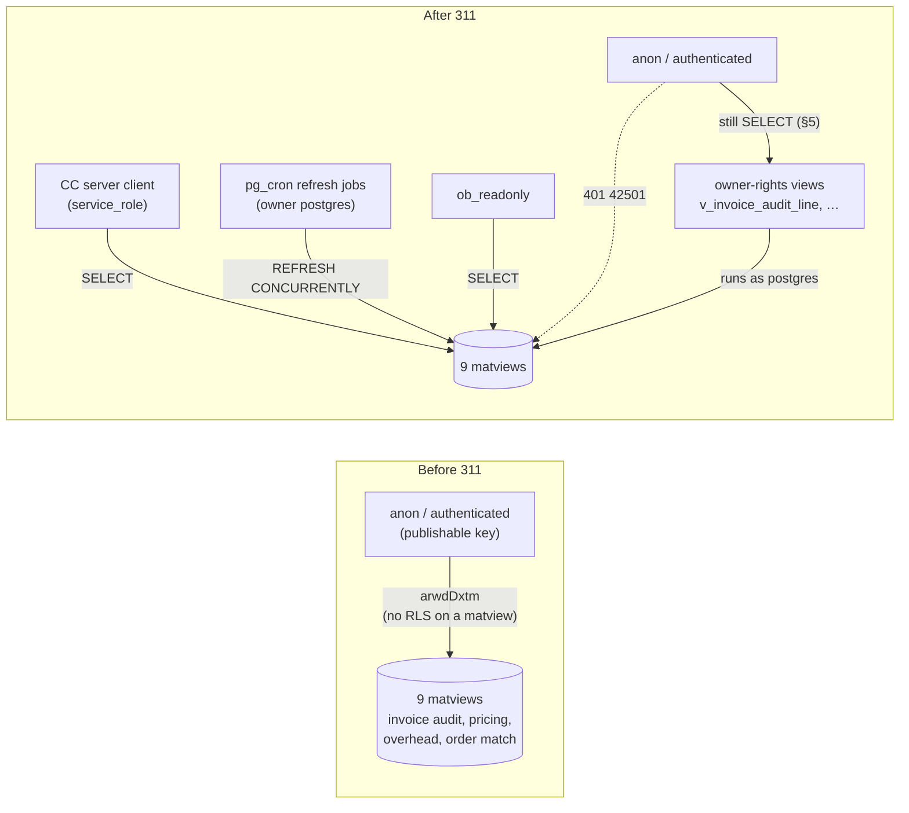

# 117 — Materialised views in `public`: service_role only

**Date:** 2026-09-29 · **Migration:** [`311-matviews-service-role-only.sql`](../schemas/cleverwork-roofer/311-matviews-service-role-only.sql) (ledger `20260929174626 311_matviews_service_role_only`) · **Status:** applied to prod `rnhmvcpsvtqjlffpsayu` · **Series:** follows [docs/115](115-properties-grant-lockdown.md) (303, 304, 309, 310)

## 1. Why

A materialised view has no row-level security. Every matview in `public` created before 310 kept the schema's default grants (`anon=arwdDxtm`, `authenticated=arwdDxtm`), and migration 288 added an explicit `grant select … to anon, authenticated` on `mv_order_acculynx_match`. PostgREST served them to anyone holding the publishable key, which ships in client bundles by design.

Measured 2026-09-29 before 311, `GET /rest/v1/<mv>?limit=1` with the publishable key **and** the legacy anon JWT:

| Matview | What it holds | anon before 311 | After 311 |
|---|---|---|---|
| `mv_invoice_audit_line` | every audited invoice line, negotiated vs billed price | `200`, rows | `401 42501` |
| `mv_invoice_pricing_office` | invoice → PE office resolution | `200`, rows | `401 42501` |
| `mv_office_agreement_versions` | agreement versions per office | `200`, rows | `401 42501` |
| `mv_vendor_office_item_history` | purchase history per vendor/office/item | `200`, rows | `401 42501` |
| `mv_order_acculynx_match` | orders ↔ AccuLynx jobs, client names | `200`, rows | `401 42501` |
| `mv_overhead_account_month` | overhead and COGS actuals by account and month | `200`, rows | `401 42501` |
| `product_vendor_pricing` | purchase-price rollup | `200`, rows | `401 42501` |
| `product_vendor_branch_pricing` | purchase-price rollup by branch | `200`, rows | `401 42501` |
| `mv_invoice_audit_summary` | (not populated) | `500 55000`, grant present | `401 42501` |

`mv_hail_heatzone_coverage` (310) was created service-role + `ob_readonly` only and was already `401`.

## 2. Who reads them (verified live, not from migration files)

| Where | Finding |
|---|---|
| Command Center | Every reader uses `createServerSupabaseClient` (`app/command-center/src/lib/supabase.server.ts`, `SUPABASE_SERVICE_ROLE_KEY`): `invoice-audit.ts`, `credit-memo.ts`, `fixed-costs.ts`, `order-audit.ts`, `price-agreement-management.ts`, `accounting/credit-memos/sent.astro`, `api/credit-memos/{add-line,review-line}.ts`, `api/invoice-audit/classify.ts`, `api/price-agreement/review/promote.ts`, `api/vendor-territories/assign.ts`. No browser client and no anon key in app code. |
| `scripts/`, `integrations/`, `agents/` | No file on any origin branch names a matview. The two callers of `rpc/alex_no_price_triage` (invoker-rights, reads `mv_invoice_pricing_office` and `mv_office_agreement_versions`) are `scripts/alex-no-price-triage.mjs` and `integrations/bridges/ingest-vendor-invoice-csv.mjs`, both service role. |
| CRM (`Clvrwrk/CRM_PWA`, 120 refs) | No match on any branch. CRM requests run as role `member` ([docs/111](111-crm-pwa-companion-repo.md)); `member` is a member of no other role and was never in these ACLs, so 311 does not change what it can read. |
| Database | Refresh jobs `pvp_refresh_nightly`, `refresh-office-pricing-matviews`, `refresh-order-acculynx-match` and `refresh-overhead-matview` run as `postgres`, the owner. `REFRESH` needs ownership, not grants. `service_pending_matview_refreshes` is `SECURITY DEFINER` owned by `postgres`. `credit_memo_claims_sync` is invoker-rights but is reached only from the `postgres` cron job. |
| PostgREST edge logs, last 24 h | 365 requests to the matviews plus 1 to `rpc/alex_no_price_triage`. Every one had apikey role **and** authorization role `service_role`, from the Coolify host (`178.105.220.14`, supabase-js on Node) or the Hetzner agent host. No `anon` or `authenticated` request. |

## 3. Decision

Same shape as 300, 304 and 309: `REVOKE ALL … FROM anon, authenticated`, explicit `GRANT SELECT … TO service_role`, keep `ob_readonly` SELECT. GRANT/REVOKE only. The migration is additive and idempotent (hard rule 1) and safe to re-run. `SET LOCAL lock_timeout = '10s'` guards against a collision with the 15-minute refresh. It was applied between runs.

**Rule going forward:** a new matview in `public` is created with `REVOKE ALL … FROM anon, authenticated` in the same migration, the way 310 does. A matview has no RLS, so a default grant exposes every row.

Migration 288's explicit anon grant stays in the file (it is history in the ledger). Replaying the schema in order still ends revoked, because 311 runs after it.

## 4. Verification (2026-09-29, after apply)

- `relacl` on all ten matviews is `{postgres=arwdDxtm, service_role=arwdDxtm, ob_readonly=r}`. `has_table_privilege` is false for `anon` and `authenticated` on SELECT and on every write privilege.
- SQL, `SET LOCAL ROLE` per matview: `42501` on all 18 anon/authenticated × matview pairs. `service_role` reads all eight populated matviews. `mv_invoice_audit_summary` fails only on `55000`, as it did before.
- Live PostgREST, publishable key and legacy anon JWT: `401 {"code":"42501"}` on all nine (and on `mv_hail_heatzone_coverage`). An anon `DELETE` also returns `401`.

### 4a. Live call path and refresh jobs

- **Command Center, production (edge logs 17:46–18:02 UTC):** from the Coolify host `178.105.220.14`, authorization role `service_role`, `mv_invoice_audit_line` returned `200` 12 times and `mv_order_acculynx_match` `200` 4 times after 311. The only `401`s in the window are the verification probes in §4.
- **Refresh jobs (`cron.job_run_details`):** `refresh-order-acculynx-match` succeeded at 17:52 (0.5 s). `refresh-office-pricing-matviews` succeeded at 18:00 (72 s; it refreshes `mv_office_agreement_versions`, `mv_invoice_pricing_office`, `mv_vendor_office_item_history` and `mv_invoice_audit_line`, then runs the CM sync and reconcile). `pvp_refresh_nightly` and `refresh-overhead-matview` run at 07:00 and 07:35 UTC. Both run as the same owner (`postgres`) as the jobs above, so grants do not affect them.

## 5. Not closed: owner-rights views over these matviews

311 closes direct matview access. It does **not** close the data. Eleven `postgres`-owned views without `security_invoker` read these matviews and still carry the default anon/authenticated grants. A view checks the relations it reads as its owner, so they still serve the same rows to the publishable key:

`v_inv_processed_weekly`, `v_invoice_audit_invoice`, `v_invoice_audit_line`, `v_invoice_audit_line_cascade`, `v_no_price_repeats`, `v_office_vendor_agreement_coverage`, `v_order_audit_line`, `v_order_audit_order`, `v_price_seed_item`, `v_top20_negotiation_dashboard`, `v_vendor_office_item_history`. (`v_office_vendor_gap_exposure` and `v_runtime_feed_freshness` are already locked.) Measured after 311 with the publishable key: `v_vendor_office_item_history`, `v_top20_negotiation_dashboard`, `v_office_vendor_agreement_coverage`, `v_order_audit_order` and `v_inv_processed_weekly` each returned `200` with a row.

These views belong to a wider class. On 2026-09-29, `public` has **90** `postgres`-owned views without `security_invoker` that anon can SELECT, and **40** tables that anon can SELECT with RLS off. The durable fix is a schema-wide pass: find readers per object as in §2, revoke, and change the `public` default privileges so new objects stop inheriting `anon`/`authenticated` grants. That is the next migration in this series. It is out of scope here because the reader audit is per object and the CRM may depend on some of them.

**Rollback:** the `GRANT ALL … TO anon, authenticated` lines in the migration header, one per matview.
