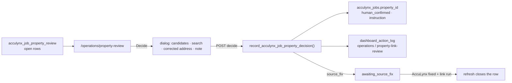

# 117 — Property Review screen: recording human decisions on the job→property queue

**Date:** 2026-09-29 · **Asked by:** Chris · **Status:** built (migration 312, `/operations/property-review`)
**Builds on:** [docs/116](116-acculynx-enrichment-round-trip.md) §4 (the review queue)

## What a person can decide

| Decision | Effect | Audit (`dashboard_action_log.decision`) |
|---|---|---|
| **Link to this property** (suggested, a nearby candidate, or one found by search) | `acculynx_jobs.property_id` set; method `human_confirmed`, confidence 1.0, `property_link_trust_tier = instruction` (hard rule 4); row `resolved` | `approve` |
| **Send back for an AccuLynx fix** (corrected address or a note required) | Row `awaiting_source_fix`, corrected address stored. The person also fixes the job in AccuLynx; when the sync brings the fixed address and a link run matches it, `refresh_acculynx_job_property_review()` closes the row | `needs_more_evidence` |
| **Not a property — dismiss** | Row `dismissed`, resolution `not_a_property` | `reject` |
| **Reopen** | Back to `open`. A link made here is removed only if the job still carries exactly that link; rows resolved by automation cannot be "reopened" from here | `resume_agent` |

Nothing on the page writes to AccuLynx (UX-09 non-effect, stated on the page and in the dialog).

## Pieces

- **Database (migration 312):** status `awaiting_source_fix`; decision/corrected-address/decided-by columns; `acculynx_jobs.property_link_trust_tier`.
  - `v_acculynx_job_property_review_queue`: the read model.
  - `acculynx_job_property_candidates(job)`: suggested property, same zip + house number, within 150 m; at most 8.
  - `record_acculynx_job_property_decision(...)`: one transaction for the write and the audit row.
  - `refresh_acculynx_job_property_review()` v2: closes `awaiting_source_fix` rows once linked, and never reopens a human decision.
- **API:** `GET /api/operations/property-review/candidates`, `GET …/search` (read; Operations access), `POST …/decide` (Operations access + `approval.decide`, so service tokens cannot decide; the actor is the WorkOS user).
- **Page:** `src/pages/operations/property-review.astro`, copied from the Friday WIP work-board shape.
  - KPI pills are scope filters, and `?scope=` deep-links one.
  - One ten-row pane with Show all (CONVENTIONS §11a).
  - View state lives in `localStorage` (`pr.view.v1`).
  - One toast (CMP-09); human-set values read "set by <name> · <ISO date>" (W-08).
- **Tests:** `src/lib/property-review.unit.test.ts`, `src/pages/api/operations/property-review/decide.test.ts`.

## Scopes on the board

Needs a decision (fix address + confirm match + choose property — 311 at launch) · Fix address in AccuLynx · Confirm a match · Choose a property · Waiting on AccuLynx fix · With the enrichment vendor (read and decidable, normally resolved by the vendor round trip) · Decided by a person.
