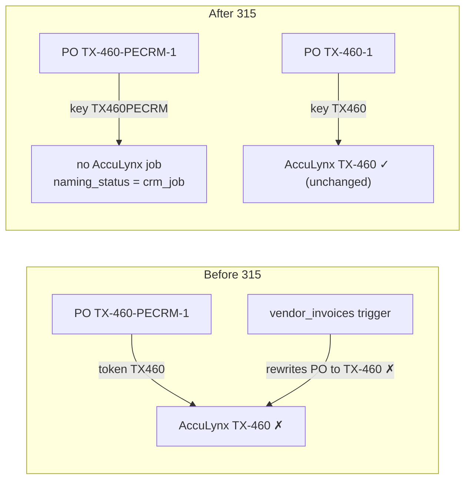

# 118 — CRM job numbers (`-PECRM`) never join an AccuLynx job

**Date:** 2026-10-01 · **Asked by:** Chris · **Status:** built (migration 315 + app/sync/gate parsers)
**Upstream:** Clvrwrk/CRM_PWA `supabase/migrations/20261004020000_crm_job_numbers.sql` (branch `claude/acculynx-stage-analysis`)
**Rollback:** [`118-rollback-pre-315.sql`](118-rollback-pre-315.sql)

## Why

The CRM numbers every job it creates `<PREFIX>-<n>-PECRM` (TX-460-PECRM), continuing past the
highest AccuLynx number for the prefix (CO, FL, GA, INS, KC, MC, TX, KS). AccuLynx does not know
about CRM numbers and can later issue its own TX-460, so **the `-PECRM` suffix is the only thing
that tells the two jobs apart.** Material POs follow the convention with a sequence: `KS-160-1`
(AccuLynx), `TX-460-PECRM-1` (CRM).

Every job-number join token in the brain truncated to `<PREFIX><n>`. Proven on prod (rolled-back
simulation, 2026-10-01) against a real AccuLynx job, TX-219:

| Input | Before 315 | After 315 |
|---|---|---|
| ABC invoice, job box `TX-219-PECRM: …`, PO `TX-219-PECRM-1` | linked to AccuLynx TX-219 (`job_token`) | unlinked, `crm_job`, canonical PO `TX-219-PECRM-1` |
| ABC invoice, PO only `TX-219-PECRM-1` / `tx219pecrm1` | linked to TX-219 (`po_token`) | unlinked, `crm_job` |
| ABC invoice, client name of a unique AccuLynx job + PO `TX-219-PECRM-2` | linked to TX-219 | unlinked, `crm_job` |
| ABC invoice, job box `TX-219: …` but PO `TX-219-PECRM-1` (conflict) | linked to TX-219 | unlinked, `crm_job` (fail closed) |
| SRS/QXO invoice inserted with PO `TX-219-PECRM-1` | **trigger rewrote the PO to `TX-219`** and linked | PO kept exactly as printed, unlinked |
| Control: PO `TX-219-1` | linked | linked (unchanged) |

## The rule

A job number whose **job-number part** contains `PECRM` (any case, any position, with or without a
dash) is a CRM number. For an ABC job box that is the text before the `:`; for a PO it is the whole PO.

1. **The key keeps the marker.** The join key is the old token with `PECRM` appended:
   `TX-460-PECRM`, `TX-460-PECRM-1`, `tx460pecrm` → `TX460PECRM`. Every existing token regex is
   unchanged byte-for-byte; the suffix is appended only when the marker is present, so no key
   without the marker can change.
2. **It never joins an AccuLynx job.** Every AccuLynx arm fails closed when either side carries the
   marker — job-name, job-token, PO-token, and the unique-client-name fallback alike. An AccuLynx job
   whose own name carried the marker would also be excluded from every join.
3. **It is not an AccuLynx-link task.** The match views report it as `naming_status = 'crm_job'`
   instead of `needs_link`; the invoice audit shows a grey "CRM job" pill, not the red
   "Needs AccuLynx link", so no one is invited to hand-link it to the AccuLynx job with the same number.
4. **FL and GA** (25 + 48 AccuLynx jobs on 2026-10-01) are added to every office-prefix allowlist that
   lacked them.

Linking a CRM-numbered invoice to its **CRM** job is a separate build (the CRM job lives in
`crm.efforts.job_number`); this change only guarantees it can never land on the wrong AccuLynx job.

## What changed

| Surface | Change |
|---|---|
| `v_invoice_acculynx_match` (ABC, mig 294) | `name_tok` / `po_tok` / `job_tok` keep `PECRM`; `is_crm` gate on all four arms; `crm_job` status; FL/GA in the prefix lists |
| `v_pe_job_label_parse` | FL/GA in the TEMP-job list (`job_norm` already kept `PECRM`) |
| `v_order_acculynx_match` → `mv_order_acculynx_match` | CRM key + gate + `crm_job`; FL/GA. The matview picks it up on its 15-minute cron |
| `v_vendor_invoice_acculynx_match` (SRS/QXO, mig 250) | gate + FL/GA |
| `vendor_invoice_po_token()` + `vendor_invoices_canonicalize_po()` trigger (migs 254/255) | token keeps `PECRM`; the trigger never rewrites a CRM PO; FL/GA |
| `parse_job_name()` | prefix keeps `-PECRM` |
| `v_qbo_job_cost_lines` (→ `v_qbo_job_costs` → `wip_ar_master`) | the bare QBO name `TX-460-PECRM` is now a job-cost key instead of unattributed. The `Customer:Job` branch already kept the whole segment, and `wip_ar_master` joins by exact string, so a CRM job's costs never land on AccuLynx TX-460 |
| `app/command-center/src/lib/pe-job-naming.ts` | PECRM-aware label and PO parsers, `isCrmJobNumber`, `crm_job`; prefix list gains INS/FL/GA (the module has no importers today) |
| `acculynx-sync` `parseJobName` (both copies) | prefix keeps `-PECRM` |
| `scripts/maya-gate.mjs` | job-number regex keeps `-PECRM`, so a CRM job is never diagnosed as the AccuLynx job |
| `qb-bank-csv.ts` | a CRM number counts as job-shaped and skips the AccuLynx recovery step |
| `invoice-audit.ts`, `invoice-audit-tree.ts` | `crm_job` is not "needs AccuLynx link" |

The address→property linker's `'ks'` hit in `link_acculynx_jobs_to_properties()` is a street/state
match, not a job parser, and is out of scope.

## Verification (prod, 2026-10-01)

- **Zero `PECRM` text in prod today** (AccuLynx jobs, ABC invoices and orders, vendor invoices, QBO bills), so
  no existing key can change.
- **Rolled-back simulation** (migration 315 verbatim inside one batch that aborts; proven to roll back
  with a reversible `COMMENT` probe first):

  | Object | Before → after |
  |---|---|
  | `v_invoice_acculynx_match` | 1,158 rows, 908 matched → identical; **0 rows changed**; link methods identical (job_name 201, po_token 683, job_token 22, client_name 2) |
  | `v_vendor_invoice_acculynx_match` | 74 rows, 68 matched → identical; 0 rows changed |
  | `v_pe_job_label_parse`, `v_credit_memo_match` | 0 rows changed |
  | `v_qbo_job_cost_lines` | 18,129 lines, 0 changed |
  | `vendor_invoice_po_token()` over every vendor PO; `parse_job_name()` over every AccuLynx job | 0 changed |
  | `v_order_acculynx_match` | 269 → **284** matched. All +15 are GA orders with dash-free POs (`GA28`, `GA29`, `GA32`, `GA41`, `GA23` → GA-23…GA-41), now linked as `po_mismatch`: the FL/GA addition, not the CRM rule. No other order changed |

- **EXPLAIN.** Join strategies unchanged: hash/merge joins on the token equality, the CRM gate
  evaluated as a Join Filter, no nested loops. Warm timings, four runs each: invoice view 108 → 121 ms,
  order view 107 → 134 ms, vendor view about 17 → 19 ms.
- Vitest 409/409, `tsc --noEmit` clean, `astro build` green, Deno `crm-pipeline.test.ts` 14/14, `deno check`
  for the sync, run from a fresh scratch copy (the worktree sits in iCloud Documents).

## Open items (not in this change)

1. **Dashed order POs never match (separate, earlier bug).** In `v_order_acculynx_match` the
   `derived_job_norm` for `KS-160-1` keeps the dash (`KS-160`), while the AccuLynx key strips it
   (`KS160`). All 1,817 orders whose PO uses the canonical dashed form are unmatched today. Fixing it
   moves AccuLynx counts by about 1,800, so it needs its own review.
2. **INS on the order and vendor paths.** The ABC invoice matcher accepts INS- (mig 294). The order and
   vendor matchers and the vendor trigger still do not, because their token regex is two letters only.
3. **QB bank Check No cap.** The QB export caps Check No at 12 characters. `TX-460-PECRM` is exactly 12;
   `TX-1234-PECRM` and `INS-123-PECRM` (13 characters) are truncated to `TX-1234-PECR` and `INS-123-PECR`. They stay distinct from the
   AccuLynx number, but accounting should choose the QB representation for CRM jobs.
4. **CRM-job linking.** A positive link from a CRM-numbered invoice or PO to `crm.efforts.job_number` is
   still to be built.
