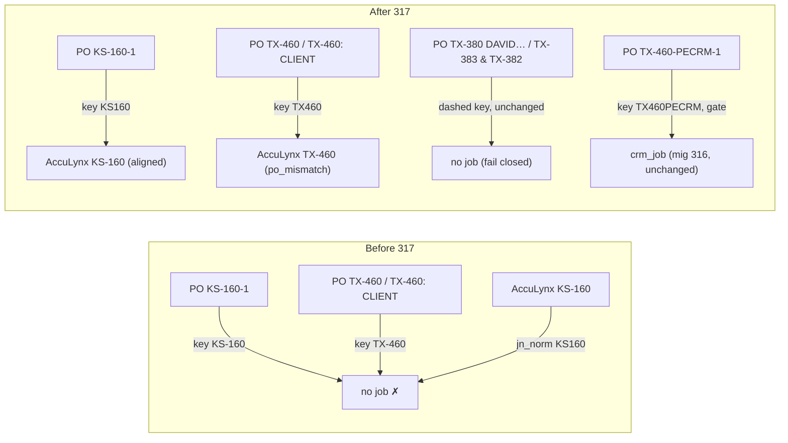

# 119 — Dashed ABC order POs get a dash-free AccuLynx job key

**Date:** 2026-10-01 · **Asked by:** Chris · **Status:** built and simulated on prod (rolled back); **not applied, waiting for Chris's review**
**Migration:** [`schemas/cleverwork-roofer/317-order-po-dash-free-job-key.sql`](../schemas/cleverwork-roofer/317-order-po-dash-free-job-key.sql)
**Depends on:** migration 316 (docs/118, CRM `-PECRM` rule), applied to prod 2026-10-01 11:03 UTC
**Rollback:** re-run section 3 (`v_order_acculynx_match`) of migration 316, then `REFRESH MATERIALIZED VIEW CONCURRENTLY public.mv_order_acculynx_match`

## Why

docs/118 open item 1. In `v_order_acculynx_match` the AccuLynx side keys a job by stripping every
non-alphanumeric (`jobs.jn_norm`: `KS-160` → `KS160`). The PO side only stripped whitespace
(`parsed_po.derived_job_norm`: `KS-160-1` → `KS-160`, `TX-460` → `TX-460`). The join
`jn_norm = COALESCE(derived_job_norm, po_norm)` could therefore never succeed for a PO in the
canonical dashed form. Only dash-free POs (`TX219`, `GA28`) matched. Measured on prod 2026-10-01:
1,817 orders with a dashed PO on the seven original prefixes, **0 matched**.

## The rule

Only the two canonical shapes get a new key, normalised exactly like `jn_norm` (upper-case, strip `[^A-Z0-9]`):

| PO shape | Example | Key before | Key after |
|---|---|---|---|
| `<PFX>-<n>-<seq>` | `KS-160-1` | `KS-160` | `KS160` |
| `<PFX>-<n>` with an optional `: client` | `TX-460`, `TX-387: CLIENT` | `TX-460`, `TX-387` | `TX460`, `TX387` |
| anything else dashed | `TX-380 DAVID…`, `TX-383 & TX-382`, `GA-GATOR` | dash-bearing | **unchanged** (still never joins) |
| CRM number (mig 316) | `TX-460-PECRM-1` | `TX460PECRM`, gated | **unchanged** |

The `<PFX>-<n>` test is anchored on the whole job-number part before `:`. A PO like `TX-46-1: CLIENT`
therefore cannot collapse to `TX461` and land on AccuLynx TX-461; it keeps the old dash-bearing
key and stays unmatched. The `aligned` / `po_mismatch` / `crm_job` / `needs_link` CASE is unchanged.

Decision: only the two shapes, with no fuzzy extraction from free text. A free-text PO names a
job ambiguously (`TX-383 & TX-382` names two jobs), and a wrong link is worse than an unlinked
order. Those 123 orders stay `needs_link` for a human.

## Verification (prod, 2026-10-01, rolled back)

Pattern from mig 315/316. First a reversible probe (`COMMENT ON VIEW` inside a batch that raises)
proved the batch rolls back: the comment was still NULL afterwards. Then migration 317 ran
verbatim inside a `DO` block that captures the view before and after and ends in
`RAISE EXCEPTION 'ROLLBACK_SENTINEL …'`. The run against prod already on mig 316 used eight
synthetic `abc_orders` rows probing against a real job (KS-100), which were rolled back too.

| Measure | Prod now (mig 316) | After 317 |
|---|---|---|
| Rows | 3,178 | 3,178 |
| Matched | **284** | **1,987** (+1,703) |
| Dashed POs (7 original prefixes) matched | 0 of 1,817 | 1,667 of 1,817 |
| `aligned` | 0 | 128 |
| `po_mismatch` | 284 | 1,859 |
| `needs_link` | 2,894 | 1,191 |
| `crm_job` | 0 | 0 (no PECRM POs in prod yet) |

- **No collateral change.** 0 previously matched orders lost, re-linked to a different job, or changed status.
  0 unmatched orders changed in any other column.
- **New links:** 1,703 = 1,195 `PFX-n` + 380 `PFX-n: client` + 128 `PFX-n-seq`.
  By prefix: CO 862 · KS 369 · TX 368 · MC 42 · GA 33 · KC 26 · FL 3.
- **`aligned` holds.** All 128 new `aligned` rows are `PFX-n-seq` POs whose text equals `<job>-<seq>`
  (0 invariant violations), and no `PFX-n-seq` PO landed in `po_mismatch`. Bare `TX-460` and
  `TX-460: CLIENT` links are `po_mismatch`: linked, but the PO does not use the `-<seq>` form. That is the
  same meaning the dash-free `GA28` links already had.
- **Probes** (KS-100): `KS-100-1` → aligned · `KS-100` and `KS-100: PROBE CLIENT` → po_mismatch ·
  `KS-100-PECRM-1`, `ks100pecrm` and `KS100-PECRM` → crm_job, unlinked · `KS-10-0: PROBE CLIENT` →
  needs_link (no collapse to KS100) · `KS-100 & KS-1001` → needs_link.
- **No ambiguous keys.** No two AccuLynx jobs share a `jn_norm`, so `DISTINCT ON` never has to choose.
- **Client cross-check** on the 380 `PFX-n: client` links: in 373 the PO client shares a word of 3+
  letters with the AccuLynx client. Of the 7 without one, 4 are benign (`CO-55: RETURN`, two empty
  `TX-29x:`, `TX-330: AL` matching "Al"). **One reads as a real disagreement:** `TX-252: <first name>`
  against a differently named AccuLynx client. It is worth a look, but the PO names TX-252 explicitly.
- **Office check** (ordering branch office vs job prefix). The new links sit overwhelmingly in the
  matching office: CO→Denver 857, KS→Wichita 367, TX→Richardson 326 plus TX-area branches 39,
  KC→Kansas City 21, GA→GA branches 29, FL→FL branches 3. MC jobs (42) are ordered from many offices.
  Clear cross-office links: 19 (Richardson←CO 5, Richardson←GA 3, Richardson←KS 2, Wichita←KC 5,
  Wichita←TX 1, Lufkin←GA 1, unassigned branch←TX 2). They follow the job number printed on the PO,
  and no pricing is joined through this view, so the office silo is unaffected.
- **Still unmatched dashed POs (163):** 123 free text, plus 40 canonical POs with no AccuLynx job of that
  number. These include zero-padded `CO-02`/`CO-05` (key `CO02`, but the AccuLynx key would be `CO2`)
  and low or old numbers (`CO-1`, `TX-127`, `TX-216`). Left alone; see open items.

### EXPLAIN

Plan shape is identical before and after: `Unique ← Sort ← Merge Left Join` on the token equality,
the CRM gate and the `<> ''` guard evaluated as a Join Filter, two seq scans (abc_orders 3,178 rows,
acculynx_jobs 1,008 kept / 6,031 filtered), **no nested loop**. Warm timings, four runs each:
133–137 ms → 161–164 ms (more rows survive the join). The view is read only through
`mv_order_acculynx_match` (8 s `statement_timeout`, playbook 9), and the 15-minute
`REFRESH … CONCURRENTLY` absorbs this easily.

## Surface impact (why it needs review)

`order-audit.ts` reads `matched`, `pe_job_number`, `client_name` and `job_category_name` from
`mv_order_acculynx_match`. `naming_status` is not rendered on the order audit.

- 1,703 orders flip from the yellow **"No PE job"** pill to **"✓ Job matched"** and gain job number,
  AccuLynx client and category. Branch and office "matched" counts rise accordingly. The page
  search now finds these orders by job number and client.
- **Headline KPI:** on 2026-10-01 every one of the 3,178 orders is `disposition = 'archived'` in
  `v_order_audit_order`, so the default (active-window) "Matched to Job" KPI does not move today. The
  "all" scope moves 284 → 1,987, and every future order with a canonical dashed PO matches on arrival.

## Apply (after Chris approves)

1. Apply `317-order-po-dash-free-job-key.sql` (one `CREATE OR REPLACE VIEW`).
2. `REFRESH MATERIALIZED VIEW CONCURRENTLY public.mv_order_acculynx_match;` (or wait ≤15 min for the cron).
3. Verify live: `select count(*) filter (where matched) from mv_order_acculynx_match` → about 1,987, and
   `/operations/order-audit?scope=all` shows dashed POs as matched.

## Open items (not in this change)

1. **Zero-padded POs** (`CO-02`, `CO-05`): would need numeric normalisation of the job number on both
   sides. It is small (a few orders), and it changes the AccuLynx key too, so it needs its own review.
2. **INS prefix** on the order path (docs/118 open item 2) is still not accepted.
3. **Free-text dashed POs** (123): stay `needs_link` for a human by design.
4. **`po_client_name` for colon-less POs** is the whole PO string (`POSITION` returns 0, so
   `SUBSTRING` starts at 1). It only shows when the order is unmatched (`COALESCE(j.client_name, …)`),
   but an unmatched `TX-216` displays "TX-216" as its client. This is cosmetic and pre-existing.
