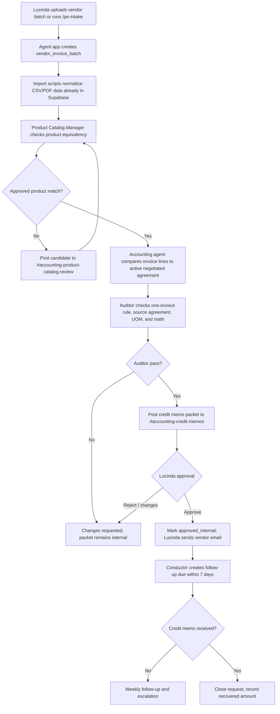

# 12 — Pro Exteriors Agent App And Slack Plan

> **Status:** Working plan, created 2026-05-30.
> **Purpose:** Define the agent app, Slack channel structure, approval surfaces, and first-workflow manifest for Pro Exteriors.

## Decision

Use the admin interface before Slack communication. Once the browser workflow is comfortable, use a single Pro Exteriors Slack app for v1, named `Pro Exteriors Open Brain`, with bot display name `ob-conductor`.

The agent workforce still has logical roles: `@ob-accounting`, `@ob-ops`, `@ob-sales`, `@ob-marketing`, and `@ob-exec`. In v1, those roles are labels and routes inside the app. Slack app manifests define one `bot_user`, so distinct Slack mentions for every vertical agent should be treated as a Phase 2 split into separate app installs if the extra operational load is worth it.

This keeps the first build smaller and safer:

- one OAuth install,
- one Socket Mode connection,
- one approval/event pipeline,
- one channel permission surface,
- one audit trail for Lucinda and Chris.

## Agent App Responsibilities

The agent app is the human interface and gatekeeper. It should be a separate Coolify service from the internal brain MCP server.

It owns:

- mirroring approved admin workflow states into Slack notifications,
- Slack Socket Mode connection.
- Slash commands and app mentions.
- Slack interactive buttons and modals.
- Review packet rendering.
- Channel routing.
- Supabase workflow writes for approvals, decisions, follow-ups, and audit logs.
- Calls to the internal brain MCP only through the existing access-key boundary.

It does not own:

- direct browser/client exposure of the Supabase service-role key,
- external vendor email sending,
- destructive record deletion,
- raw unrestricted table access for agents,
- Researcher/web retrieval with internal brain credentials.

## Slack Channel Structure

| Channel | Visibility | Owner | What Goes Here |
| --- | --- | --- | --- |
| `#accounting-credit-memos` | Private | Lucinda | One-invoice credit memo request packets, approval buttons, rejection reasons, and follow-up status. |
| `#accounting-vendor-intake` | Private | Accounting + Conductor | Vendor portal batches: CSV exports, ZIP/PDF uploads, extraction status, failed imports, missing file requests. |
| `#accounting-product-catalog-review` | Private | Ops + Accounting | Product equivalency candidates, SKU/UOM questions, human approvals before instruction-grade catalog mappings. |
| `#ob-conductor-digest` | Private | Conductor | Daily/weekly digest, stale approvals, follow-up escalations, owner-visible status. |
| `#ob-agent-audit-log` | Private | Auditor | Append-only review packet state changes, approvals, rejections, and manual overrides. |
| `#ob-qc-review` | Private | Quality Control | Repeated miss patterns, vendor pricing standard changes, monthly owner review items. |

Keep the financial/pricing channels private. Invite the app only to channels it needs.

## Slack App Manifest

The v1 manifest lives at:

`deployment/remote/slack/pro-exteriors-open-brain.manifest.yaml`

It enables:

- `@ob-conductor` app mentions,
- direct messages to the app,
- file share intake events,
- slash commands:
  - `/pe-ob`
  - `/pe-credit`
  - `/pe-catalog`
  - `/pe-intake`
- interactive buttons/modals,
- Socket Mode, so the first Coolify build does not require public Slack request URLs.

## Slash Commands

| Command | Purpose | Example |
| --- | --- | --- |
| `/pe-ob` | General route into the Open Brain. | `/pe-ob accounting status` |
| `/pe-credit` | Vendor invoice audit and credit memo workflow. | `/pe-credit audit invoice 123456` |
| `/pe-catalog` | Product equivalency and UOM review. | `/pe-catalog review pending` |
| `/pe-intake` | Vendor batch intake and import status. | `/pe-intake vendor invoices ABC 2026-04` |

Slash commands should acknowledge quickly, write a workflow row in Supabase, and post longer results asynchronously.

## Interactive Approval Actions

Use stable callback/action IDs in Slack blocks so every click can be tied back to Supabase.

| Callback / Action | Human Meaning | Supabase Effect |
| --- | --- | --- |
| `credit_memo_request.approve` | Lucinda approves the draft packet for human external send. | Mark packet `approved_internal`; record approver, timestamp, Slack message TS. |
| `credit_memo_request.request_changes` | Packet needs correction before approval. | Mark `changes_requested`; create agent task with required edits. |
| `credit_memo_request.reject` | Packet should not move forward. | Mark `rejected`; retain reason and archive intent. |
| `credit_memo_followup.mark_sent_by_human` | Lucinda sent the vendor email outside Slack. | Mark `sent_by_human`; set follow-up due within 7 days. |
| `credit_memo_followup.mark_received` | Credit memo received. | Mark `received`; capture received amount and close date. |
| `product_match.approve` | Candidate SKU/product equivalency is correct. | Promote mapping to instruction-grade after Auditor record check. |
| `product_match.reject` | Candidate match is wrong. | Mark rejected and keep for training/audit history. |
| `product_match.needs_review` | More evidence needed. | Keep candidate at evidence tier and route to Ops/Accounting. |

Agents may draft and route; humans approve external-send readiness.

## Supabase App Needs

The current Pro Exteriors Supabase project already has invoices since 2023, negotiated price agreements, products, vendors, and region data. Treat this instance as the production-shaped pilot brain, not as a throwaway toy database.

The app should add only narrow workflow/control tables until we review real rows:

| Need | Purpose |
| --- | --- |
| `agent_app_installations` | Slack team/app/channel config and enabled workflow flags. |
| `agent_action_log` | Append-only record of agent actions, prompts, tool calls, and human decisions. |
| `slack_review_packets` | Durable link between Supabase workflow records and Slack messages/buttons. |
| `vendor_invoice_batches` | Track CSV/ZIP/PDF portal exports, source email/upload, extraction status, and batch errors. |
| `vendor_region_mappings` | Explicit PE `regions` to vendor-region mapping after testing real `regions` and `abc_regions` values. |
| `product_equivalency_candidates` | Agent-proposed product/SKU matches with confidence, evidence, and status. |
| `product_equivalency_approvals` | Human approval history for product matches and UOM conversions. |
| `vendor_invoice_audits` | One audit run per invoice, with status and Auditor result. |
| `credit_memo_requests` | One-invoice request header, status, approver, sent-by-human timestamp, follow-up due date, received amount. |
| `credit_memo_request_lines` | Disputed invoice lines with invoice price, negotiated price, UOM conversion, and expected credit math. |
| `credit_memo_followups` | Follow-up tasks and outcomes until credit memo receipt or escalation. |

All workflow tables should be append-friendly and archive-only. Operational source tables stay intact.

## Same Supabase For Sandbox And Production

Because the project already has the real historical data, use a controlled pilot mode instead of pretending it is a blank sandbox.

Required guardrails:

- Every new workflow row has `environment = 'sandbox' | 'pilot' | 'production'`.
- Default first-run mode is `pilot`, meaning real reads but internal-only Slack output.
- No agent writes to existing invoice, product, agreement, or region source tables.
- Agent writes go to workflow/control tables only.
- Any source-table correction is drafted as a human task, not executed by the agent.
- `service_role` stays inside Coolify services only and is rotated before go-live.
- The dashboard/human viewport uses publishable/anon access with RLS-safe views only.

## First Workflow

## Human Viewport Needs

The dashboard/Obsidian layer should let a human inspect:

- every pending credit memo packet,
- why each line was flagged,
- source invoice and source agreement references,
- product match approval history,
- Auditor pass/fail reason,
- Lucinda's approval and sent-by-human status,
- follow-up due dates and recovery amount,
- archived/rejected packets,
- monthly SOP owner review status.

Obsidian remains the instruction-grade SOP surface. Every generated SOP needs a named owner, version history, and monthly review before it can become instruction-grade.

## Build Order

1. Validate the admin interface MVP first. See `docs/13-pro-exteriors-admin-interface.md`.
2. Add workflow/control tables in local Supabase first.
3. Query real `regions` and `abc_regions` values and design `vendor_region_mappings`.
4. Wire admin product-equivalency review packets.
5. Wire admin one-invoice credit memo packet renderer.
6. Add Auditor gate and admin audit-log event stream.
7. Install the Slack app from the manifest and record channel/user IDs.
8. Mirror approved admin events to Slack, then add stale packet digest.
