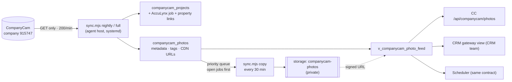
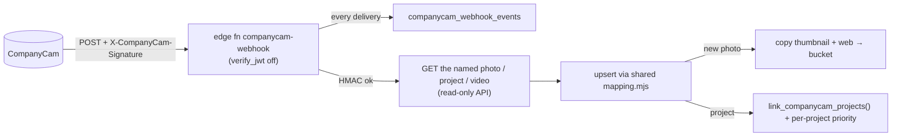

# 120 — CompanyCam integration: photo mirror for CC, CRM and Scheduler

**Date:** 2026-10-01 · **Asked by:** Chris · **Status:** data layer live (migration 318, applied to prod as `316_companycam_mirror` + `316b` + `316c` before main took 316; full metadata mirror); copy queue running; app surfaces staged (see §6)
**Supersedes:** the 2026-05-29 design in `integrations/bridges/companycam/README.md` ("photos are not stored in the brain — only URLs")



## 1. What CompanyCam lets us do (full inventory, 2026-10-01)

Source: the official OpenAPI spec (`developers.companycam.com/openapi/public_api_v1.yaml`, 155 operations), the developer portal guides (auth, rate limits, webhooks, OAuth, deep links, MCP) and the changelog. Base URL `https://app.companycam.com/public_api/v1`; `{data, errors, meta}` envelope, cursor paging (`after`/`before`, max 100 per page).

| Area | Read | Write (available, **not used** — we mirror only) |
|---|---|---|
| Projects | list (active/archived), search, show, collaborators, assigned users, labels, comments, custom fields, documents, pages, checklists, project tasks, videos | create, update, archive/restore, description, labels, comments, custom fields, documents, invitations, tasks, checklists |
| Photos | list company-wide or per project (filters: project, user, group, tag, date), show, comments, tags, `include=tags,annotations,comments` | update, tag, describe, comment, upload, delete |
| Videos / documents | list + show | upload / create |
| Company data | current company, users, groups, labels, tags, boards and phases, project groups, time entries + summary | users, groups, tags, boards |
| Sales Suite | proposals, invoices (+ line items), price book | create/update (plan-gated) |
| Webhooks | list, show, delivery history | create/update/delete; scopes `project.*`, `photo.*`, `comment.*`, `document.*`, `video.*`, `todo_list.*`, `task.*`, `project_task.*`; HMAC-SHA1 signature (`X-CompanyCam-Signature`); disabled after 25 errors |
| Other | mobile deep links (`ccam://projects/<id>`, `ccam://camera/<id>`, `ccam://photos/<id>`), hosted MCP server (240 req/min/company, monthly tool-call cap by plan) | — |

**Auth:** Personal Access Token (Read Only or Read & Write, created by a manager/admin at app.companycam.com/access-keys) or OAuth2 with granular `{resource}:{action}` scopes. Ours: 1Password `CW_Master / CompanyCam-PE-PWA-CRM` (`credential`), an **admin** token. **Rate limit:** 240 GET/min per token, 100/min for writes (one bucket); 429 + `Retry-After`.

**Measured on our account (2026-10-01):** 6,948 projects (0 archived), **311,204 photos**, 557 videos, 624 documents, 20 project labels, 22 photo tags. Custom fields are not enabled on our plan (403). AccuLynx is already wired to CompanyCam through 32 CompanyCam webhooks (`companycam.acculynx.com`), but the AccuLynx `relation_id` on our projects is null, so there is **no shared ID** — joins are by address and property.

### Facts that drive the storage decision (measured, not assumed)

- **Photo files are public, unsigned and permanent.** `uris[]` point at `static.companycam.com/...`; an anonymous GET returns 200, with or without the `?d=` query (it is a cache-buster, not a signature). Anyone holding the URL can see the photo, forever, and we cannot revoke it per viewer.
- **Project public links expose whole galleries.** Projects are `public: true` with a `public_url` that opens the full project anonymously.
- **CompanyCam already renders three sizes:** original ≈ 419 KB, web ≈ 34 KB, thumbnail ≈ 15 KB (100-photo sample). Annotated variants share the base URL when a photo has no annotations.
- `photo_url` (`app.companycam.com/assets/...`) needs a CompanyCam login; it is not usable in our apps.

## 2. The choice

| | A. Link only (CompanyCam public URLs, thumbnails in our apps) | B. Download everything into Supabase first | **C. Hybrid: mirror metadata now, copy bytes progressively, serve ours once copied (chosen)** |
|---|---|---|---|
| Time to value for open jobs | Immediate | Days (139 GB before the first page works) | **Immediate** (CDN fallback) and open jobs copied first |
| Privacy | Unrevocable public URLs for homes, interiors, receipts and insurance documents | Private bucket, signed URLs, our auth | **Private bucket, signed URLs**; CDN URLs only during the copy window, and only behind our auth |
| Survives CompanyCam churn (plan lapse, URL scheme change, deletion) | No: the brain's evidence trail disappears with the vendor | Yes | **Yes**, once copied (~1–2 days for the whole library) |
| AI / vision / evidence use (supplements, EEAT, QC) | Must re-fetch from a third party each time | Local bytes | **Local bytes** |
| Cost | $0 | ≈ $1–3/month | **≈ $1–3/month** |

**Recommendation: C.** The brain is the asset (SOUL.md), and insurance-claim and before/after evidence must outlive any single vendor. Public-link-only (A) is the weakest choice twice over: the links are already public with no expiry, so "anyone with the link" really means anyone, and the asset lives entirely in CompanyCam. B is correct as an end state but makes the open jobs wait. C gets B's end state without the wait.

**Cost (Supabase Pro):** full clone ≈ 311k × 468 KB ≈ **139 GB** (originals 124 GB, web + thumbnail 15 GB). 100 GB is included; the extra ~40 GB is about $0.85/month at $0.021/GB. App views serve the 15–34 KB variants, so egress stays well inside the included 250 GB. No Supabase image transformations are needed (CompanyCam's own sizes are copied), which avoids the per-origin-image transform fee. Videos (557) and documents (624) are a later, separate pass.

## 3. How it works

- **Mirror** (`integrations/bridges/companycam/sync.mjs`, GET-only client `read-only-client.mjs`):
  - **nightly:** projects newest-updated first, stopping at the watermark; photos newest-created first, stopping at the watermark; then re-reads the photos of every changed project (tags and descriptions don't move `created_at`).
  - **full (Sundays):** walks everything and marks absentees `removed_at` by **run id** (never deletes, hard rule 1).
  - Upserts carry the same keys on every row and never include link or storage columns, so a sync cannot wipe a copy or a human link (playbook 2).
- **Links** (`link_companycam_projects()`, evidence tier, hard rule 4; never overwrites an `instruction` link):
  1. AccuLynx job carried over from the July backfill matcher (street + ZIP exact or disambiguated = 0.95, unique name similarity = 0.8, pin within 150 m = 0.6).
  2. Property from that job (`via_acculynx_job`).
  3. Otherwise property by street + ZIP on `properties.address_key` (0.95), otherwise a unique property within 30 m of the pin (0.7).
  4. For newer projects: the AccuLynx job on the same property (single job = 0.85; nearest-created within 120 days = 0.75).
- **Copy priority** (`refresh_companycam_copy_priority()`):
  1. Open or working AccuLynx job (Lead, Prospect, Approved, Completed, Invoiced).
  2. Captured in the last 90 days.
  3. Closed job, captured in the last 2 years.
  5. Linked to a property.
  9. Back library.
  The worker claims batches with `FOR UPDATE SKIP LOCKED` and stores `<project>/<photo>/<variant>.jpg` in **two passes** (318b): a display pass (thumbnail + web, ~50 KB per photo, which is what apps show) for the whole queue, then an originals pass (~420 KB each) in the same order. Annotated variants are stored only when they differ. A killed run's claims return to the queue after 30 minutes. Measured from the laptop's home uplink, the full-size pass managed about 1 photo/s, so the bulk copy belongs on the agent host.
- **Serving:** `v_companycam_photo_feed.source` is `brain` (sign `thumbnail_path` / `web_path` from the private bucket) or `companycam` (use the CDN URL). CC's `/api/companycam/photos` does this already (`src/lib/companycam-photos.server.ts`).
- **Runtime:** `scripts/companycam-sync.sh` + `deployment/remote/systemd/openbrain-companycam-{sync,copy}.{service,timer}` on the US agent host. The sync runs at 02:15 CT and the copy every 30 min, about 6k photos per tick, so the whole library takes roughly a day. Both report to the runtime board (`runtime-registry.ts`), and `int.companycam` is pinged anonymously (expect 401).

## 4. Rollout record (2026-10-01)

| Step | Result |
|---|---|
| Preflight of 318 (then numbered 316) against prod (rolled back) | link fn on the July list: 5,360 jobs, 5,115 properties |
| 318 applied as `316_companycam_mirror`, then `316b` (link fn SECURITY DEFINER: `acculynx_backfill` is not readable by service_role) and `316c` (same-property job matcher) | ✓ |
| Subset write (1 page each) | 100 projects, 100 photos, links + priority ✓ |
| Full metadata sweep | see §4a |
| Copy, priority 1 (open jobs) | see §4a |

Trap found on the way: login shells on this Mac export a **different** project's `SUPABASE_URL`. `sync.mjs` now makes an explicit `--env-file` win over the shell and logs the target project ref at start.

### 4a. Numbers after the first full run

_Filled in by the session that ran it; see the daily log 2026-10-01._

## 5. Webhook (approved by Chris 2026-10-01)



- **Receiver:** `supabase/functions/companycam-webhook` (Deno), deployed v1. Bad signature → 401 (verified live); non-POST → 405. It re-reads the resource rather than trusting the payload, logs every delivery (unverified bodies are not stored), and always returns 200 after logging so CompanyCam never disables the hook over our processing errors. The nightly sync stays as the backstop.
- **Secrets:** Supabase Vault (`companycam_webhook_token`, `companycam_access_token`), read through `companycam_secret()` (service role only). Chosen over edge-function env secrets so no Management-API token or Coolify change is needed.
- **Registration:** `integrations/bridges/companycam/register-webhook.mjs` is the bridge's only CompanyCam write. It creates one webhook for scopes `photo.*`, `project.*`, `video.*` and `comment.*`, refuses a duplicate, and `--rotate` replaces the token.
- **Monitoring:** `select event_type, signature_ok, process_result, process_error from companycam_webhook_events order by id desc limit 20;`

## 5a. Videos (approved by Chris 2026-10-01)

557 videos: avg ~79 MB, largest seen 241 MB, ~45 GB in total. `playback_url` is a presigned S3 URL that expires in about 5 hours (anonymous HEAD → 403), so `sync.mjs copy-videos` re-reads each video from the API immediately before copying. It stores `<project>/videos/<id>/video.{mp4,mov}` plus the large thumbnail, open-job videos first. **The Supabase project-wide upload limit is 50 MB**, so larger files return 413 and are parked as `storage_status='skipped'`, `copy_error like 'too_large%'`. After the limit is raised (Dashboard → Storage → Settings → global file size limit, e.g. 1 GB; the bucket already allows 1 GB), re-queue them with:

```sql
update companycam_videos set storage_status = 'pending', copy_attempts = 0 where copy_error like 'too_large%';
```

## 6. App surfaces

- **Command Center:** `/api/companycam/photos?propertyId|jobId|projectId` for agents (service bearer token) and pages. It is registered in `MONITORED_ROUTES` (expect 401). CC has no property or job detail page yet; the first UI is a photo strip on `/operations/property-review` (reviewers seeing the house is the fastest way to confirm a link).
- **CRM** (`Clvrwrk/CRM_PWA`): the boundary is docs/111 and docs/114 (the CRM reads CC data only through its own `crm_gateway` objects and the `crm_property_reader` role). Contract: a `crm_gateway` view over `public.v_companycam_photo_feed` (filtered to the property in hand), plus a way to sign storage paths for CRM users. Either a storage SELECT policy on `companycam-photos` for the CRM's member role, or a server-side call to the CC API. Both are CRM-team changes and need a grant decision (`GRANT SELECT ... TO crm_property_reader`) that this doc does not make on its own. The CRM's existing `packages/adapters/providers/companycam.ts` can *create* CompanyCam projects (ADR 0008). That write path is the CRM's, not the mirror's.
- **Scheduler** (`Clvrwrk/scheduler.proexteriorsus.net`, no local checkout): same contract as the CRM; it needs per-job photos (`jobId`) for crew briefs.

## 7. Open decisions

1. ~~Register the CompanyCam webhook~~: approved. The receiver is deployed; registration needs one `op run` with 1Password unlocked (§5).
2. Grant `crm_property_reader` read on the photo feed and choose the CRM signing path (§6).
3. Install the two systemd units on the agent host and put `COMPANYCAM_ACCESS_TOKEN` in its `master.env` (the agent cannot change host state over SSH in auto mode). Runbook: §8.
4. ~~Videos~~: approved. Raise the Supabase project upload limit so files over 50 MB can be stored (§5a).
5. Documents (624): copy or link only?

## 8. Agent-host install (Chris, about 5 minutes)

On `178.156.203.23` (`ssh -i ~/.ssh/hetzner_office root@178.156.203.23`), after `main` carries this work:

```bash
cd /opt/openbrain/a-roofers-open-brain && git pull --ff-only origin main
```

Add the token to master.env (paste it from 1Password `CW_Master / CompanyCam-PE-PWA-CRM`, field `credential`), then confirm the repo `.env` targets `rnhmvcpsvtqjlffpsayu`:

```bash
printf 'COMPANYCAM_ACCESS_TOKEN=%s\n' 'PASTE_TOKEN_HERE' >> /root/.config/cleverwork/master.env
```

```bash
grep -E '^SUPABASE_URL=' /opt/openbrain/a-roofers-open-brain/.env | sed -E 's#https://([^.]+).*#\1#'
```

```bash
cp deployment/remote/systemd/openbrain-companycam-{sync,copy}.{service,timer} /etc/systemd/system/ && systemctl daemon-reload && systemctl enable --now openbrain-companycam-sync.timer openbrain-companycam-copy.timer
```

Smoke test (one copy tick, then the board):

```bash
systemctl start openbrain-companycam-copy.service && tail -5 /root/.companycam-sync/logs/companycam-copy.log
```

Rollback: `systemctl disable --now openbrain-companycam-{sync,copy}.timer`. The mirror tables and bucket stay; nothing in CompanyCam is touched.
