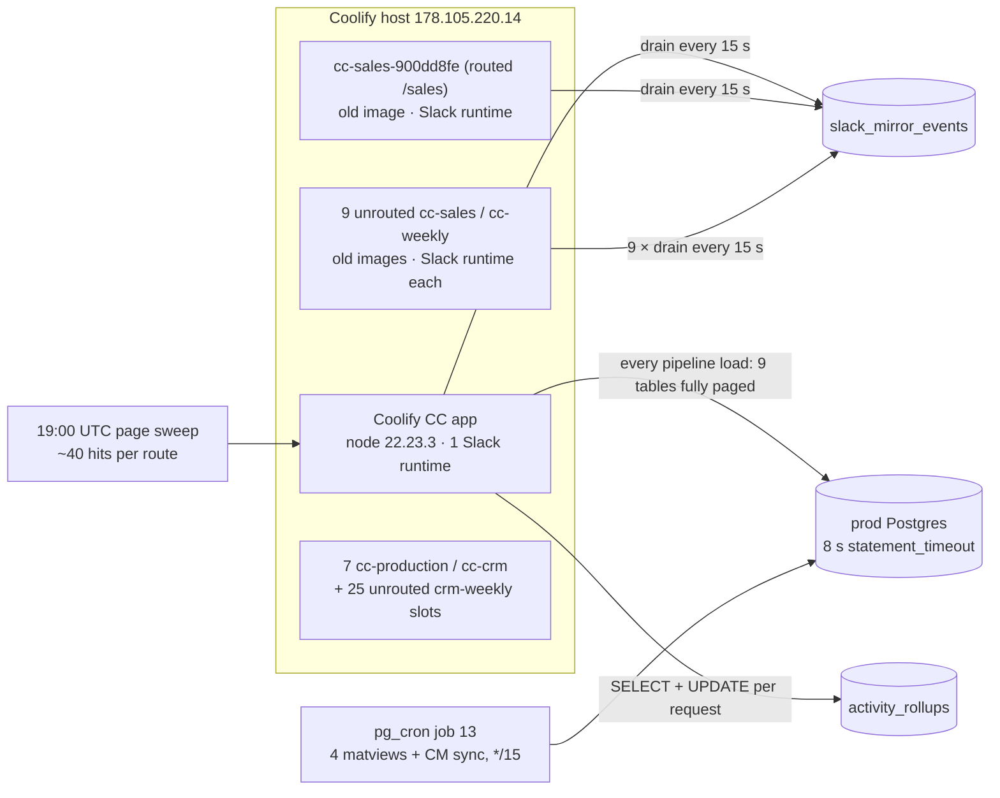

# 122 — Prod DB load, 2026-10-02: stale Command Center containers and full-table pollers

**Date:** 2026-10-02 · **Asked by:** Chris · **Status:** cause found; migration 323 applied to prod; app fixes deployed to cc.proexteriorsus.net (`0c6a79cd`, live check: 2 agent calls → rollup count 2, cold 8.9 s / cached 0.8 s); host cleanup done by Chris 20:53Z (§5: `slack_mirror_events` 42.7/min → 7.7/min, 11 → 2 Slack runtimes; the /sales mirror's copy goes with the CRM release-script fix)



## 1. What happened (19:00–19:40 UTC)

Postgres logged 110 statement timeouts in the 19:00 hour, against a 24-hour baseline of 0–60 per hour. The load came from four sources stacked on top of each other:

1. **A page sweep through the live CC.** Between 19:00 and 19:40, every top-level route received about 40 hits from a WorkOS-authenticated ("human") session: `/accounting/invoice-audit` 72, `/executive/pipeline` 52, `/` 46, and about 40 each for the rest. The 18:00 hour had 2 each. This is not the 06:00 CT site sweep, which uses a service token. The DB logs cannot say who ran it; Sentry user or the CC access log can.
2. **Each page load re-reads whole tables.** `loadExecutivePipelineDashboard` pages nine source tables 1,000 rows at a time with no server cache. That is 19 pages of `acculynx_job_milestone_history` (18,230 rows) and 12 of `crm_pipeline` (11,549 rows), plus seven more tables. Every filter change, drill-down, and 5-minute client poll repeats it. The 812 milestone pages in 40 minutes equal about 43 full loads.
3. **Every request did a read-modify-write on `command_center_activity_rollups`.** A sweep sends many concurrent increments to the same `(route, actor, hour)` row. They queue on the row lock (897 calls, 4.3 s average) and lose counts.
4. **Background load:** pg_cron job 13 (`refresh-office-pricing-matviews`) ran 19:30:00–19:31:48, along with 11 Slack mirror drains (§2).

The acculynx-sync v50 run that walked 2 jobs in about 110 s and then hit 504 was a casualty of this contention. It is not a separate fault.

**Correction to the original symptom.** The 74.5 s, 14.8 s and 11.4 s durations were **one** run of job 13, not three consecutive runs. auto_explain logs each statement of the multi-statement command on its own line, and all three lines carry the full command text.

## 2. Who polls `slack_mirror_events` (1,505 requests in 40 minutes)

`app/command-center/runtime/slack-socket-runtime.mjs` drains the queue every 15 s. One process makes 160 requests in 40 minutes. Edge logs showed two client builds from the Coolify host:

| client | requests (40 min) | 15-s phases |
|---|---|---|
| node 22.23.3 (current Coolify app) | 162 | 1 |
| node 22.23.0 (older image) | 1,567 | ~10 |

`docker ps` on the host (read-only) shows **11 live `slack-socket-runtime.mjs` processes**: the Coolify app plus 10 old containers (`cc-sales-*` ×7, `cc-weekly-*` ×3). All 10 run old code with the full CC environment, so they carry Slack tokens and run `restart=unless-stopped`. The CRM release flow starts a `cc-sales` mirror from a CC image for every release and never retires the previous one. Exactly one of them, `cc-sales-900dd8fe7c9d`, is still routed: Traefik `crm-cc-sales-mirror.yml` sends `cc.proexteriorsus.net/sales` and `/api/sales` to it. The other nine are unrouted.

Effects beyond DB load:

- **Each stale container also holds a Slack Socket Mode connection.** Slack spreads events across open connections, so most inbound slash commands and messages may have been answered by weeks-old code.
- **The 11 drains race on the same queued rows**, so a queued mirror event can be posted more than once. The queue has been empty since July, so this has not happened yet.
- **Each stale container runs its own old in-process work.** That includes boot and daily cache prewarms (full reads of every surface) and hourly `vw_hail_heatzone_coverage` reads that predate migration 310. That accounts for 56 of the 24-hour 500s on that view.

**Index?** No. The drain query uses `slack_mirror_events_status_idx` and runs in 0.1 ms on 13 rows. The fix is one consumer, not an index or a longer interval.

## 3. The pagers

| table | caller | why so often | fix |
|---|---|---|---|
| `acculynx_job_milestone_history` (575 GET / 40 min) | `executive-pipeline.ts` `selectAll` in `loadExecutivePipelineDashboard` and `loadJobsForLocation` | 19 pages per load × ~43 loads (sweep, 5-minute poll, filters, drill-downs) | 60 s shared source cache (§4) |
| `crm_pipeline` (335 GET) | same loaders | 12 pages per load | same |
| `command_center_activity_rollups` (~190 + PATCHes) | `activity-rollups.server.ts`, on every request | SELECT then UPDATE per hit; row-lock queue during a sweep | migration 323 RPC (§4) |

## 4. Fixes shipped

| fix | where | verified |
|---|---|---|
| `bump_command_center_activity(route, actor, hour)`: one atomic `INSERT … ON CONFLICT DO UPDATE request_count + 1` | `schemas/cleverwork-roofer/323-activity-rollup-atomic-bump.sql`, **applied to prod** (ledger `20261002200346 323_activity_rollup_atomic_bump`; the parallel session's job-walk cron was renumbered to `324-acculynx-job-walk-cron.sql` in 67d93ef2) | As service_role inside a rolled-back transaction: insert = 1, second call = 2. anon and authenticated have no execute. Local dev server against prod: three API calls → count 3. |
| `persistActivityRollup` calls the RPC: one round trip, no lost counts | `app/command-center/src/lib/activity-rollups.server.ts` | same |
| `selectAllCached`: 60 s TTL, in-flight dedupe, rejections not cached, copy per caller. All 13 source reads in the two loaders use it. | `app/command-center/src/lib/executive-pipeline.ts` | Local against prod: cold `/api/executive/pipeline.json` 8.8 s, repeat **0.077 s**, identical 29,623-byte payload, status `live`. No loader mutates source rows (checked). 412 tests pass and the build is green. |
| `COMMAND_CENTER_SLACK_RUNTIME=off` stops the supervisor from starting Slack even when tokens are present | `app/command-center/runtime/start-command-center.mjs` | Only affects images built from this commit onward. The CRM release flow must set it on every non-Coolify container (§5). |

## 5. Host cleanup (Chris runs it; not executed by the agent)

**Stop the nine unrouted Slack-running containers.** `docker stop` keeps each container, so `docker update --restart=unless-stopped <name> && docker start <name>` brings any of them back.

```bash
ssh -i ~/.ssh/a_roofers_open_brain_ed25519 root@178.105.220.14 'for c in cc-sales-8d7cd9f6ef56 cc-sales-53e93af47f2e cc-sales-023aa93ca9a1 cc-sales-cec64be17517 cc-sales-2041f739551c cc-sales-abe370db3689 cc-weekly-e6c2c64827d7 cc-weekly-0083c28e1fd0 cc-weekly-99a371c43eed; do docker update --restart=no "$c" && docker stop "$c"; done'
```

**Live `/sales` mirror (`cc-sales-900dd8fe7c9d`).** Leave it serving. Its image predates the opt-out, so on the next CRM release, relaunch the mirror with `COMMAND_CENTER_SLACK_RUNTIME=off` **and** the `SLACK_*` variables removed. Then retire the previous slot in the same step. The fix belongs in the CRM_PWA release script.

**Hygiene (optional).** Seven old `cc-production-*` / `cc-crm-*` containers (no Slack, unrouted, but they ran boot prewarms) and 25 unrouted `crm-weekly-*` slots (the live one is `crm-weekly-e8f4e73d0678`) use about 4 GB. Stop them once the CRM owner confirms none is a rollback target.

**Check afterwards.** Over any 10-minute window, edge logs should show `slack_mirror_events` at about 40 requests (4 per minute) from a single client build.

**Result (2026-10-02, Chris ran the stop at 20:53:09–16Z).** All nine exited with restart `no`. 20:38–20:53Z: 648 polls (~42.7/min). 20:53:25–20:59:56Z: 50 polls (~7.7/min), 25 from the live app and 25 from the `/sales` mirror. Slack runtimes on the host: 11 → 2.

## 6. Checked and left alone

- **pg_cron job 13 does not overlap itself.** It ran 4 times per hour over the last 24 h at 58–125 s each, against a 900 s spacing, and pg_cron never starts a second copy of a running job. It is a steady 7–14% duty cycle, mostly `REFRESH … mv_invoice_audit_line` (45 s mean). The pricing surfaces need these matviews fresh (CONVENTIONS §10b, mig 289), so the schedule stays. If it ever exceeds about 300 s, split `mv_invoice_audit_line` into its own job.
- **The CompanyCam original-copy claim** (`claim_companycam_original_batch`, 189 timeouts in 24 h) has a good plan: `companycam_photos_original_queue_v2_idx`, 163 ms on a cold cache. Its timeouts are contention victims. 156k originals remain, and the worker runs every 30 minutes from the US agent host.
- **pg_stat_statements has been accumulating since 2026-03-28.** Its top line (`vw_hail_heatzone_coverage`, about 127 CPU-hours) is mostly from before migration 310. Use postgres_logs, or reset the stats, for a one-day view.
- **Local dev servers hit prod.** Every `astro dev` boot runs the full cache prewarm against prod (one timed out on invoice audit during this check), and another session's dev server was sweeping pages at 20:05 UTC. Worth a dev-mode switch to skip boot prewarm.
