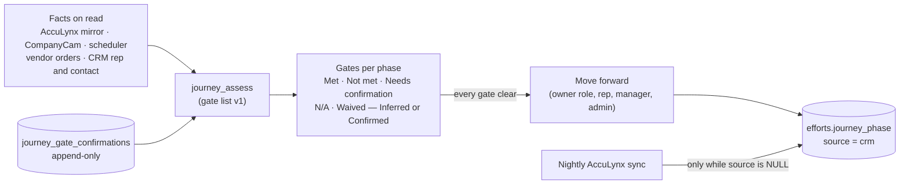

# 124 — CRM job journey: gate list v1, where it lives, and the pending lien-waiver wording

**Date:** 2026-10-05 · **Decided by:** Chris (CTO), mockup approved "as drawn" (private artifact claude.ai/artifact/Kwje1UD3gpXQ3hbT16nfkK; boards Main, Actions, Catalog, Phone) · **Status:** in build in the CRM repo (`Clvrwrk/CRM_PWA`, branch `claude/crm-job-journey`, migration `20261024010000_crm_job_journey.sql`); not merged, not applied, not deployed · **Canonical record:** CRM repo `docs/DECISIONS.md` JOURNEY-1–JOURNEY-12 and `docs/design/CRM-JOB-JOURNEY.md`

## Why it exists

The CRM had the ten journey phases in four places that never met: names in code, gates in two proposal documents, responsible roles in `crm.journey_roles`, and the phase number in `crm.efforts.journey_phase`, written only by the AccuLynx import. Nothing evaluated a gate per job or let anyone move a phase, and every nest job link opened a read-only AccuLynx mirror. That is why Chris saw AccuLynx buckets instead of the journey.

## Gate list v1 in one paragraph

38 gates across 10 phases (P1 3, P2 3, P3 2, P4 4, P5 3, P6 9, P7 3, P8 3, P9 4, P10 4): 18 read automatically from a connected system, 20 manual, 5 waivable (P2 photos on fast-track, P4 deposit, P6 payment condition, P6 field evidence, P8 customer sign-off), 2 entry gates (lien waivers into P9 and P10). P6 is the Readiness Policy's 8 checks plus crew insurance. *Balance paid in full* is never waivable. Retail jobs skip P4 → P6 and their P5 gates read Not applicable. It is a CRM working list approved by Chris, **not** the client's activated policy: the 80 client requirements stay pending.

## Where it lives

| Piece | Where |
|---|---|
| The list (versioned `journey-gates-v1`) | `crm_private.journey_gate_catalog()`, IMMUTABLE, in the CRM migration. Not a CRM variable, not `crm.journey_roles` |
| Facts and results | `crm_private.journey_facts(ids[])` (set-based) and `crm_private.journey_assess(...)` (IMMUTABLE). Computed on every read; nothing derived is stored |
| A person's entries | `crm.journey_gate_confirmations`, append-only and audited; each entry pins the list version |
| Who set the stage | `crm.efforts.journey_phase_source` (`acculynx` / `crm`, NULL = AccuLynx-derived), `journey_phase_set_by`, `journey_phase_set_at` |
| Reads and writes | `crm.read_job_journey`, `crm.confirm_journey_gate`, `crm.set_journey_next_action`, `crm.move_journey_phase`; routes under `/api/v1/jobs/{key}/journey` |
| The card | top of the CRM Job Profile and the Customer record |
| Gate table with sources | CRM repo `docs/design/CRM-JOB-JOURNEY.md` § 3 |

## Rules worth remembering

- **Inferred = evidence.** Auto results are tagged Inferred until a person confirms them. Manual gates read Needs confirmation and never Met on their own (hard rule 4, trust-tier discipline).
- **The CRM stage sticks.** Before the end-of-October AccuLynx cutover, once a person sets the CRM stage, the nightly sync never changes `journey_phase` again; it keeps updating the AccuLynx milestone shown beside it.
- **Move back is admin only,** with a reason of at least 10 characters. Confirm and N/A need an evidence note of at least 10 characters; waive needs a reason.
- **Owner shown:** the job's rep for Sales Consultant gates; otherwise the office seat holder, then the company holder (tagged Company), then Unfilled. Kansas City, Multi-Family/Commercial, Insurance Program and Florida have no office seat holder in any owner role today.
- **Permissions are in SQL:** gate owner or approve role, the job's rep (Sales Consultant gates and next action), the job's sales manager or a manager over its office, admins. View as is read-only.
- **The drawn rows are enforced in SQL too:** Not applicable only on the 5 gates the list allows (never a lien waiver entry gate or *Balance paid in full*); Confirm never overrides an automatic Not met result (so money owed cannot be confirmed away); *Payment condition met* is waived only by Executive approval or an admin; proposal exceptions are approved by Sales Manager approvals, a manager or an admin, not the rep alone.
- **Company-level holder:** a seat with no office of its own is company-level even under an office-scoped parent, so the Administrative Operations and production management seats (no office, Texas parent) cover the offices with no holder, as the Catalog board shows.

## Pending admin change: lien-waiver wording in Team › Roles

The migration deliberately does not write `crm.journey_roles`. After the CRM release an admin changes the Crew compliance and lien waivers role in Team › Roles:

| Today | Change to |
|---|---|
| P9 own, task "Unconditional lien waivers on file" | P9 own, task **"Conditional final lien waivers on file"** (P9 entry gate) |
| — | **Add** P10 own, task **"Unconditional final lien waivers on file"** (P10 entry gate) |

This settles the conflict between PR #123 (conditional finals into P9, unconditional into P10) and the old role text. The waiver table itself (`crm.lien_waivers`, PR #123, migration `20261019010000`) is not applied, so both entry gates are manual Needs confirmation gates until it is.

## Also prepared, not run

The 8 Readiness Policy checks as a pending `requirements.readiness_gates` CRM-variables version (propose, then a second admin approves). The journey does not depend on it.
