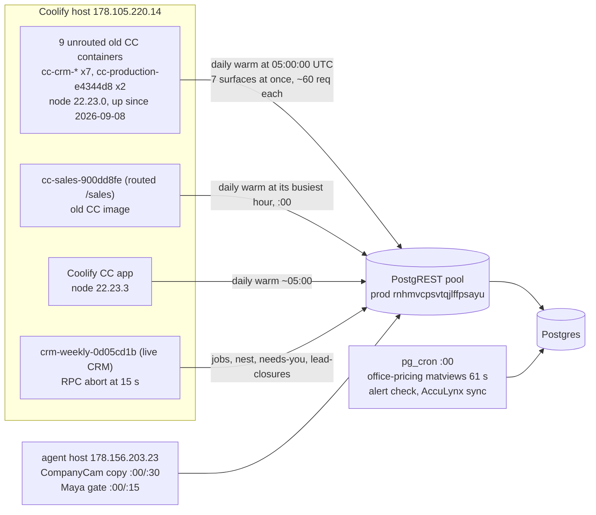

# 125 — Top-of-hour DB load starves the CRM (2026-10-08)

**Date:** 2026-10-08 · **Asked by:** Chris (via the CRM "Jobs are not available" session) · **Status:** cause found. Migration 326 is applied to prod. The CC and agent-timer changes are on branch `contrib/cleverwork/top-of-hour-db-load`. Stopping the old containers on the host is Chris's step (§4). The CRM retry is a proposal and is not shipped (§5).



## 1. What happened

At 05:00:22–05:01:29 UTC the live CRM (release `0d05cd1b`) returned 503 `provider_unavailable` / `transport` on `/api/v1/jobs`, `/nest`, `/team/needs-you` and `/lead-closures` (Sentry PWA-CRM-Z, -10, -24 to -28). Each RPC waited the full 15 s of `AbortSignal.timeout(15000)` and never reached Postgres. In the same minute, **every** PostgREST request from every app queued: average origin time 39 s, max 116 s, 35 5xx.

This happens **every day at 05:00 UTC**: 2026-10-07 05:00 had 543 old-image requests at 38 s average and 79 5xx. The CRM's other 503s in the last 7 days were 15:09 on 10-07 (one effort page), so the 05:00 minute is the only repeating one.

## 2. Who calls prod at :00 (edge logs)

Callers are identified by IP and the `x-client-info` header. The old CC image runs node 22.23.0, the live Coolify CC runs 22.23.3, the CRM sends no `x-client-info`, and edge functions run in Deno.

**05:00 UTC, 2026-10-08 (545 requests in the minute):**

| caller | requests | avg / max origin time | what |
|---|---|---|---|
| old CC containers (22.23.0, Coolify host) | 535 | 39 s / 116 s | full cache warm: `crm_pipeline` 25 GET + 25 HEAD, `dashboard_action_log` 25 HEAD, `abc_invoices` 24, `abc_price_list_items` 20, `acculynx_jobs` 18, `invoice_documents` 17, `roof_system_category` 15, `vw_hail_heatzone_coverage` 10 HEAD (10 × 500), `v_order_acculynx_match` 9, `v_invoice_audit_invoice_vendor` 6, `rpc/territory_snapshot` 5 (3 × 5xx, 79 s avg) … |
| live CC (22.23.3) | 4 (264 at 04:59) | 29 s | its own daily warm landed at 04:59 |
| CRM (no client info) | 3 completed | 5 s | the rest aborted at 15 s |
| agent host 178.156.203.23 | 2 | 81 s | CompanyCam copy / Maya gate |
| edge function (acculynx-sync) | 1 | 87 s | pg_cron job 5 |
| pg_cron | — | — | `refresh-office-pricing-matviews` 123.7 s, **failed on statement timeout**; `service-matview-refresh-requests` 05:01 **job startup timeout** |

**22:00 UTC, 2026-10-07 (628 requests, 9 5xx):**

| caller | requests | avg origin time | what |
|---|---|---|---|
| agent host | 312 | 0.4–0.9 s | `companycam_photos` PATCH 131 (copy worker), `agent_intake_notices` 23, `agent_fix_approvals` 20 (Maya gate) |
| old CC containers | 170 | 2–9 s | daily warm of one container (milestone history 19 pages, `crm_pipeline` 15, invoice audit views) |
| edge function | 142 | 0.1 s | acculynx-sync writes (`acculynx_contacts` 64, `acculynx_raw` 42, watermarks 40) |
| pg_cron | — | — | office-pricing matviews 85 s, alert check 31 s |

Old-image daily warms also land at 13:00, 18:00, 22:00 and 23:00 every day (154–314 requests, 4–18 5xx each).

### Why 05:00

`prewarm.server.ts` schedules a daily warm at `setHours(hour, 0, 0, 0)`, so always at :00. The hour is the container's busiest human hour minus one, and **5 by default when the container has never seen a human**. The nine unrouted containers left over from the 2026-09-08 CRM releases have no traffic, so all nine (container clock UTC) warm at 05:00:00. Each warm ran the seven surface loaders with `Promise.all`, and each loader fans out further, which put ~535 requests on PostgREST within seconds. The containers still run code from before migration 310, so they read the per-row views (`vw_hail_heatzone_coverage`, `v_order_acculynx_match`, `v_branch_item_api_price`) that the live app now reads as matviews.

### pg_stat_statements (cumulative since 2026-03-28)

| statement | calls | mean | max | total |
|---|---|---|---|---|
| `vw_hail_heatzone_coverage` (3 shapes) | 244k | 1.3–2.2 s | 8.0 s | 127 h |
| `v_order_acculynx_match` | 5.7k | 0.4–1.3 s | 8.0 s | 1.9 h |
| `territory_snapshot()` | 2,650 | 1.2 s | 7.9 s | 0.9 h |

Over the last 24 h the edge logs show only 16 `territory_snapshot` calls (8 old image at :00, 60 s avg; 8 live, 3 s avg). The 2,650 figure is the cumulative history, not today's rate.

## 3. Fixes, by caller

| caller | fix | where | state |
|---|---|---|---|
| 9 unrouted old CC containers | **stop them** (they serve nothing) | host, §4 | **Chris to run** |
| `/sales` mirror (old CC image) | relaunch with `COMMAND_CENTER_PREWARM=off` on the next CRM release; it then also reads the matviews | CRM_PWA release script | follow-up |
| CC daily warm | never at :00: minute 41 plus 0–4 min jitter (`COMMAND_CENTER_DAILY_WARM_MINUTE`); only after a human has used the container; the 7 loaders warm **one at a time**; `COMMAND_CENTER_PREWARM=off` turns off boot and scheduled warms | `app/command-center/src/lib/prewarm.server.ts` | branch, needs the CC deploy |
| `territory_snapshot` | surface cache 30 s → 10 min; the territory assign endpoint invalidates it | `vendor-territories.ts`, `api/vendor-territories/assign.ts` | branch |
| per-row views (`vw_hail_heatzone_coverage`, `v_order_acculynx_match`, `v_invoice_audit_invoice`, `v_branch_item_api_price`) | the live CC already reads `mv_*`; only the old images read the views | — | goes away with §4 |
| duplicate `acculynx_jobs` full scans | the old containers' paginated scans (86/day, 13 s avg). The live CC goes through `selectAllCached` (60 s TTL, in-flight dedupe, docs/122), and the edge function's 383/day are 44 ms reads | — | goes away with §4 |
| pg_cron job 13 office-pricing matviews (61 s mean) | `*/15` → `3,18,33,48` | mig 326 | **applied** (ledger `20261008052422`, sha matches the file) |
| pg_cron acculynx-hourly-sync | `0` → `4` | mig 326 | **applied** |
| pg_cron acculynx-alert-check | `*/15` → `5,20,35,50` | mig 326 | **applied** |
| agent host CompanyCam copy | `*:00/30` → `*:08/30` | `deployment/remote/systemd/openbrain-companycam-copy.timer` | **Chris to install**, §4 |
| agent host Maya gate | `*:0/15` → `*:06/15` | `deployment/remote/systemd/openbrain-maya-gate.timer` | **Chris to install**, §4 |

After this change, nothing heavy is scheduled at :00. The minute map is: matviews :03/:18/:33/:48, AccuLynx sync :04, alert check :05/:20/:35/:50, Maya gate :06/:21/:36/:51, order match :07/:22/:37/:52, CompanyCam copy :08/:38, hail :12/:27/:42/:57, AccuLynx job walk :30, CC daily warm :41–:45.

## 4. Host steps (Chris runs these; the agent is not allowed host writes)

**Stop the nine unrouted old CC containers.** They are not routed by Traefik (docs/122 §5). `docker stop` keeps each container, so `docker update --restart=unless-stopped <name> && docker start <name>` brings any of them back.

```bash
ssh -i ~/.ssh/a_roofers_open_brain_ed25519 root@178.105.220.14 'for c in cc-crm-087d5ad-check cc-crm-4bb9a87-check cc-crm-a7ed610-check cc-crm-e4344d8 cc-crm-eafb185-check cc-crm-f360de4 cc-crm-f731b77-check cc-production-e4344d8 cc-production-e4344d8-friday; do docker update --restart=no "$c" && docker stop "$c"; done'
```

**Move the agent-host timers off :00.** The services run from `/opt/openbrain/a-roofers-open-brain`. Copying only the two timer units leaves that checkout alone. Run from a checkout of this branch:

```bash
scp -i ~/.ssh/hetzner_office deployment/remote/systemd/openbrain-companycam-copy.timer deployment/remote/systemd/openbrain-maya-gate.timer root@178.156.203.23:/etc/systemd/system/
```

```bash
ssh -i ~/.ssh/hetzner_office root@178.156.203.23 'systemctl daemon-reload && systemctl restart openbrain-companycam-copy.timer openbrain-maya-gate.timer && systemctl list-timers --no-pager | grep -E "companycam-copy|maya-gate"'
```

Expected next runs: CompanyCam copy at :08 or :38, Maya gate at :06/:21/:36/:51. Rollback: copy the timers back from `main` before this change (`*:00/30`, `*:0/15`) and run the same reload.

**Check afterwards.** At the next 05:00 UTC, the edge logs should show no `22.23.0` burst, and Sentry project `pwa-crm` should show no `provider_unavailable` / `transport` events.

## 5. CRM proposal: one retry for idempotent reads (not shipped)

`packages/crm-server/src/client.ts` `rpc()` sends every call as `POST /rest/v1/rpc/<name>` with `AbortSignal.timeout(15000)`. On any fetch failure it throws `CanonicalFault('provider_unavailable', 503, 'transport')`, and its comment rules out hidden retries for mutations. One slow minute therefore leaves the Jobs page on an error.

The proposal:

- Add a frozen `READ_RPCS` allowlist: the RPCs behind GET routes (`/api/v1/jobs`, `/nest`, `/team/needs-you`, `/lead-closures`, …), each one a `STABLE` function with no writes. A test asserts that every name on the list is `STABLE` in the migrations, so a mutation can never be added to it by accident.
- In `rpc()`, only for a name on that list, and only when the failure is the transport catch (abort or network): wait 400–1,200 ms (jittered), then retry once with `AbortSignal.timeout(12000)`. HTTP errors, unreadable responses and every mutation keep today's behavior. Tag the retry in telemetry (`retry=1`) so Sentry still shows the slow minute.
- Worst case is about 28 s instead of 15 s before the error. In both the 05:00 events the pool had drained by 05:02, so a retry at ~16 s would have had a good chance.

This is a behavior change on the live CRM. Chris decides, and then it ships through the normal pinned CRM release.

## 6. Checked and left alone

- `runtime-heartbeat-pump` (*/5, 1.6 s mean), `acculynx-reconcile` (*/10, 0.1 s) and `service-matview-refresh-requests` (every minute, ~0 s) are cheap. They were victims at 05:00, not causes.
- The live CC's `selectAllCached` and `bump_command_center_activity` (docs/122) are working: the live app averages 3–4 requests per minute between warms.
- Prewarm has no unit tests. The change keeps the public API and passes 412 tests plus `astro build` in a fresh clone (`~/top-of-hour-load-build`).
