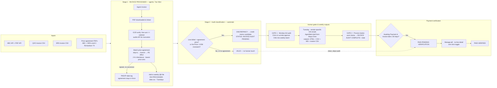

# 81 — Invoice Audit v2: Process Contract & Build Plan

**Date:** 2026-08-05
**Status:** APPROVED (process approved by Chris in session, 2026-08-05; OCR build explicitly approved)
**Supersedes / amends:** docs/63 (daily invoice processing — payment-gating inverted), docs/59 (UI contract — dispositions removed), docs/57 §1 (variance decision tree — replaced by binary classification), docs/50 (communications preview — scrapped for this workflow)
**Related:** docs/79 (QXO/SRS onboarding), docs/40/51 (agreement builder + OCR ingest), migration 195 (office inheritance), proposals/2026-06-19 (invoice PDF OCR — now approved to build)

---

## 1. Diagram

Full annotated diagram (source of truth for the flow):
- `outputs/invoice-audit-v2/invoice-audit-process-v2.png`
- `outputs/invoice-audit-v2/invoice-audit-process-v2.excalidraw` (editable)

## 2. Definitions (the status contract)

Two independent axes per invoice: **pipeline/audit status** and **paid status**.

### Axis 1 — pipeline / audit status

| Status | Meaning |
|---|---|
| **Invoice Processed** | All intake steps done: API/CSV ran → invoice row added → PDF downloaded & linked → OCR verification passed (parsed line-sum equals invoice subtotal; proves no API line truncation) → price agreement matched via office inheritance → `PAEXP-[date_expired]` tag applied if the governing agreement lapsed without a successor → included in this week's QB download `INV-PROCESSED-[date_processed].csv`. |
| **Invoice Audit Pending** | Invoice has ≥1 discrepancy line (billed above matched agreement price, No-Price, or UOM mismatch) awaiting the human credit-memo approval gate. |
| **Invoice Audit Complete** | Stamped by the **Process** button with a `completed_at` date. Process does nothing else — no export. |

Rules:
- **No price agreement anywhere ⇒ invoice is valid as billed** (applies to all QXO invoices today).
- A **clean invoice** (zero discrepancy lines) skips Audit Pending entirely and goes straight to *Paid-pending verification* on the payment axis.

### Axis 2 — paid status

| Status | Meaning |
|---|---|
| **Awaiting Payment** (`exported`) | In a QB export batch, payment not yet confirmed. The *pill* for this is removed from the dashboard; the state remains in the ledger. |
| **Paid-pending verification** | Applied to invoices currently in Awaiting Payment whose **invoice date** is ≥ 60 days old; clean invoices land here directly. |
| **Paid-Verified** | Human one-click toggle in the Manage view (no line detail shown). |

## 3. Decisions (2026-08-05, Chris)

> **⚠️ Decisions 2 and 14 are SUPERSEDED (Chris, 2026-08-25).** The weekly QB file is **one file per vendor**, not a single cross-vendor file: ABC, SRS and QXO each keep a **separate QB bank register**, so a mixed-vendor export would post one vendor's invoices into another's register. This restores the docs/63 contract (`invoice-payment.ts`: "One file per vendor — a batch spanning N vendors produces N files") and is enforced by `scripts/build-inv-processed-weekly.mjs`, which refuses to write a mixed file. Migration 280.
>
> **Also new (Chris, 2026-08-25):** a **negative total IS a credit memo**, whatever the vendor flag says, and never belongs in a QB payables export — it routes to credit-memo reconciliation against its original invoice, or a **CM TBD** line where the original is not yet identified. See `v_credit_memo_tbd` (migration 280).

1. **Inversion confirmed:** payment runs ahead of audit; the audit recovers credits behind payment. All do-not-pay holds ("Held — credit memo", disputed-portion holdback email language) are removed.
2. **One weekly QB file**, `INV-PROCESSED-[date_processed].csv`, generated every **Tuesday**. Replaces the on-demand payment/register batch exports.
3. **Weekly cadence:** agents process Tue–Mon; **Monday** is the full human audit & approval; **Tuesday** all files and emails are generated and sent to Lucinda & Chris via the **Maya.Chen** email (AgentMail).
4. **60-day clock runs from the invoice date**, and applies **only to invoices currently in Awaiting Payment**.
5. **Classification is binary:** billed > matched agreement price ⇒ credit memo candidate; else valid. No-Price and UOM-mismatch lines **are shown as discrepancies**. The `gate-negotiated` mandatory human gate is **gone**.
6. **All six human disposition actions are deleted.** The human's only audit action is approving requested credit memos into the weekly batch.
7. **Communications Preview workflow is scrapped entirely** — no Slack for this process.
8. **Credit memo request emails are vendor-specific** (ABC / QXO / SRS get separate emails). AgentMail drafts from Maya.Chen go to the approved human verifiers (Chris & Lucinda) who review and forward. Output folder per request: **HTML + CSV + MD**. Tracker CSV contains **only that week's** credit memo invoices. "Date sent" is replaced by **"date credit memo email generated"**.
9. **Process button is a pure stamp:** all Invoice Audit Pending → Invoice Audit Complete + completion date. No export side effects.
10. **OCR verification is approved to build now**, using the **Unstructured** app. It is explicitly an *audit of the vendor API* — it caught ABC's 10-line truncation (ABC claims fixed; we verify every invoice to the penny anyway).
11. **Texas territory:** Richardson, TX is the primary PE office for all shared branches; **only branches exclusively in Euless, TX** assign to Euless. No other overlap picks pending.
12. **Prior CM request ($1,941.44 / 15 invoices) was sent and challenged.** The full re-audit supersedes it: **every line** in `benchmark_reconciliation.xlsx` is recalculated against its own PE office's inherited agreement (by date and branch), including lines the old batch method zeroed out.
13. **Vendors:** all three vendors are in scope. QXO has no price agreements ⇒ all QXO invoices valid. SRS price agreements = the **Level 4 price sheet**, applied to **all Richardson TX branches**.
14. Spreadsheets/CSVs (tracker, reconciliation) are **cross-vendor**; only the request emails are vendor-specific.

## 4. Price agreement rules (restated, binding)

- All branches within the **two-hour drive window** inherit the PE office's main price agreement.
- Where agreements **overlap**, the **lowest price wins at the line-item level** (keyed on item + unit).
- If two PE offices overlap, a **human selects the primary office per branch** (TX resolved per decision 11).
- **Expired agreements with no follow-on remain in force** (evergreen); every audited line under one carries the tag **`PAEXP-[date_expired]`** (stored on the line audit row, rolled up as an invoice pill).
- **No agreement ⇒ valid as billed.**

## 5. Removed from the current build

- The six disposition actions (`accept-neg`, `accept-tbn`, `accept-30d`, `accept-nochallenge`, `credit-flag`, `credit-noflag`) and the auto-disposition tolerance tiers as *decision-makers* (docs/57 §1 tree).
- `gate-negotiated` mandatory human gate.
- Do-not-pay holds and hold-release machinery as payment gates (ledger history is retained; nothing is deleted — hard rule 1).
- The Communications Preview tab and Slack/email per-line drafts (docs/50) for this workflow.
- The **Awaiting Payment pill** (state remains in `invoice_payment_processed`).
- On-demand Process/Register CSV exports (replaced by the single Tuesday file).

## 6. Cleanup waves (one-time, before the new cadence starts)

**Wave A — register-gap:** all 54 invoices in `outputs/abc-register-gap-2026-07-26/abc_invoices_not_in_register-v2.csv` (including the credit-memo rows) are marked **Invoice Processed**, running the full retroactive pipeline (PDF link, OCR verify, agreement match, PAEXP tags). They are **already in the QB register — no re-export**.

**Wave B — credit-memo re-audit:** every line in `benchmark_reconciliation.xlsx` (98 credit-flag lines) is re-audited against its invoice's specific PE office inherited agreement (by date and branch). All affected invoices → **Invoice Audit Pending**. Then generate the new vendor-specific credit memo request (HTML format per the 07/28 template) + week-scoped tracker for human approval. This supersedes the challenged $1,941.44 request.

## 7. Build plan (phased)

> Priority: unblock the accounting team first (statuses + cleanup + re-audit), then UI, then automation. All migrations additive/idempotent (hard rule 1). Live branch = `main`; confirm via `/healthz buildCommit` before each deploy.

### Phase 0 — Schema & status model (migration 197)
- Add invoice-level pipeline status: `invoice_pipeline_status` table (or columns on `invoice_documents`) with `pipeline_status CHECK IN ('invoice_processed','invoice_audit_pending','invoice_audit_complete')`, `processed_at`, `audit_completed_at`, `ocr_verified_at`, `ocr_line_sum`, `ocr_matches_subtotal`.
- Broaden `invoice_payment_processed.status` CHECK with `'paid_pending_verification'`, `'paid_verified'` (+ `verified_at`, `verified_by`).
- Add `paexp_tag text` to `invoice_line_audit`; vendor-generic audit views (union `abc_*` + `vendor_invoices`).
- **Verify:** statuses queryable end-to-end on prod; no existing rows violated.

### Phase 1 — Cleanup Wave A (register-gap → Invoice Processed)
- Script the retroactive pipeline over the 54 invoices; report per-invoice results (PDF ✓, OCR ✓/✗, agreement link, PAEXP tags).
- **Verify:** all 54 stamped `invoice_processed`; OCR mismatches (if any) queued for human review, not silently passed.

### Phase 2 — Cleanup Wave B (re-audit → new CM request)
- Re-price all 98 benchmark lines via `v_office_vendor_price_item` (office-inherited, invoice-date-effective, lowest-wins).
- Affected invoices → `invoice_audit_pending`; regenerate `credit_memo_requests`/`_lines` from the recalculated variances.
- Produce the request packet: vendor-specific HTML email(s) + tracker CSV + MD, to the output folder for Chris & Lucinda approval. **Nothing sends without human forward** (SOUL boundary).
- **Verify:** every line shows office, agreement #, effective date, PAEXP tag where applicable; totals reproducible from the DB.

### Phase 3 — Dashboard rework (`/accounting/invoice-audit`)
- Audit view: discrepancy lines only (+ CM request); remove disposition panel, comms tab, negotiated gate, tolerance-tier actions.
- Kill the Awaiting Payment pill; add the **Paid-pending verification** pill → Manage list (invoice-level only) with one-click **Paid-Verified** toggle.
- Re-wire **Process** to the pure stamp; add the 60-day sweep (invoice-date ≥ 60d ∧ status `exported` → `paid_pending_verification`; clean invoices direct).
- **Verify:** browser walkthrough on prod data; deploy per the explain-then-ship gate.

### Phase 4 — OCR verifier (Unstructured app)
- Per-invoice PDF parse → line extraction → line-sum == subtotal to the penny; mismatch ⇒ human-review queue + `lines_truncated` style flags. Wire into Stage 1 for all new invoices; backfill open ones.
- **Verify:** rerun over the 145 previously-truncated ABC invoices; confirm ABC's "fixed" claim empirically.

### Phase 5 — QXO/SRS onboarding
- Ingest SRS **Level 4 price sheet** as an SRS agreement mapped to the Richardson TX office (Euless-only branches → Euless); QXO ships with no agreements (all valid).
- Load QXO/SRS invoice CSVs via `integrations/bridges/ingest-vendor-invoice-csv.mjs`; extend audit/processing views + UI to the generic `vendor_invoices` tables. Open item: PDF source for QXO/SRS invoices (none identified yet — PDF/OCR steps apply to ABC only until resolved).
- **Verify:** SRS lines price-match against the Level 4 sheet; QXO invoices surface as valid.

### Phase 6 — Weekly automation (Tuesday generation)
- Tuesday job: build `INV-PROCESSED-[date_processed].csv` (single cross-vendor file), vendor-specific CM email drafts via Maya.Chen AgentMail to Chris & Lucinda, output folder HTML+CSV+MD, week-scoped tracker with "date generated".
- **Verify:** dry-run week alongside manual operation before cutover.

## 8. Open items

1. **QXO/SRS invoice PDF source** — no API/portal identified; "PDF downloaded & linked" is ABC-only until one exists.
2. **SRS Level 4 sheet item mapping** — sheet is description-level (no vendor item numbers); falls back to description-keyed matching per migration 195's rule.
3. **Old disposition history** — retained append-only in `invoice_line_audit`; new UI simply stops writing those decision values.
