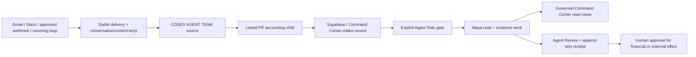

# Maya accounting runtime: CAT-first work, recurring loops, and channel intake

Status: production candidate for CAT-20 / PEC-173 (2026-08-06).

## Outcome

Maya is the active accounting front door. Gmail, directly addressed Slack work, approved future webhook events, Linear assignments, and recurring loop occurrences resolve to one `CODEX AGENT TEAM` source before another team can own execution. A PE-CC-DevTeam child holds accounting work. Maya claims only linked `[MAYA]` children explicitly moved to `Agent Todo`, records a lease/receipt, moves the issue to `Agent Working`, adds evidence, and leaves the result in `Agent Review`.

## Inbox review that shaped the contract

The live inbox was reviewed read-only. Representative accounting inputs were:

| Work | Required treatment | Reconciled lineage |
| --- | --- | --- |
| Kansas/Wichita Tamko Titan quote, $101/SQ effective 2026-08-03 | Validate exact vendor branch, SKU, scope, UOM, and date; prepare versioned proposal | CAT-24 → PEC-177 |
| SRS IKO DFW quote (Cambridge $92, Dynasty $103, Nordic $129, all SQ) | Preserve PEC-111 as canonical; human-gated agreement promotion | CAT-25 → PEC-111; PEC-161 duplicate |
| Colorado document `POS-35943`, stated 2026-06-03 through 2026-12-31 | Parse untrusted PDF, verify scope/UOM/effective dates | CAT-27 → PEC-164; PEC-165 duplicate |
| EagleView master workbook | Inventory evidence; never infer job/property joins | CAT-26 → PEC-112; PEC-160 duplicate |
| Google/Slack security notices | Exact owner authorization question; no invented recovery/deactivation claim | Blocked review work, not accounting extraction |

Raw bodies, attachment IDs, credentials, and customer data are not copied into this document, Fast.io, or curated memory.

## Dedupe and lineage

Gmail uses three source keys:

1. day-scoped normalized subject plus meaningful attachment names (same-day forwarded-copy convergence),
2. Gmail thread ID (reply convergence),
3. Gmail message ID (delivery-level evidence).

Slack uses workspace/channel/thread plus message ID. Recurring work uses loop ID plus its day/month/quarter/year period. The first matching key resolves the orchestration. A confirmed CAT creation followed by an uncertain child creation is retained as ambiguous and never blindly retried. A later reconciler can repair the parent link using the provider-confirmed CAT issue UUID.

## Accounting authority

Maya can read accounting work queue, price-agreement branch detail, pending credit memos, and the Friday WIP/AR board through her named Command Center bearer identity. Linear-work mode allows read/evidence tools and Linear comments; it removes external email/Slack sends and financial mutations.

- Price-list work is a versioned proposal. Price comparisons use ABC `priceQty.uom`, `abc_invoice_lines.price_per_uom`, and `v_item_uom_map`; raw quantity/UOM/unit-price fields are forbidden.
- Credit-memo packets use pricing-UOM-normalized lines, remain internal, and require human approval for vendor send/disposition.
- WIP/AR answers cite freshness and keep billed AR separate from unbilled work. Maya cannot silently overwrite retained rows or human-edited dates/notes.
- QuickBooks production remains read-only / mirror-only.

## Recurring loops

All schedules use `America/Chicago`.

| Cadence | Occurrences |
| --- | --- |
| Daily | Weekday 07:00 inbox audit; weekday 17:00 summary |
| Weekly | Monday 08:00 vendor aging; Friday 09:00 document quality |
| Monthly | First day 09:00 vendor onboarding; 10:00 extraction accuracy |
| Quarterly | Jan/Apr/Jul/Oct day 1, 09:00 top-20 vendor relationship audit |
| Annual | Jan 15, 09:00 intake-system review |

The Orgo runtime is the execution owner. `runtime_auth.recurring_loops` is the durable default-deny registry; legacy Kasm cron generation is not a second production owner.

## Channels

| Channel | State | Contract |
| --- | --- | --- |
| Gmail | Active through Maya's pinned Composio connection | Half-hour poll, stable source keys, CAT source + child, receipt |
| Slack | Active through pinned Composio trigger | Direct address only, CAT source before work/reply, result comment |
| Generic webhook | Available through authenticated Command Center intake | Stable external delivery ID, orchestration key, required CAT issue |
| Signal | Disabled | Must pass third-party-agent-tool gate plus signed ingress, identity/replay/dedupe/egress review, kill switch, rollback, and human approval |
| Future channel | Disabled by default | Same channel-neutral delivery/orchestration contract; no adapter-specific shortcut |

## Persistence and audit

Migration 217 adds default-deny runtime tables for channel deliveries, intake orchestrations, Linear work claims, recurring-loop registry, and append-only Linear receipts. It also gives `dashboard_action_log` a unique idempotency key. `/api/agent/intake` now requires `orchestrationKey` and `catSourceIssue`; Gmail, Slack, recurring, and manually queued Linear work post this record after the CAT/PEC pair exists and before Maya acts. Duplicate provider deliveries cannot append duplicate action-log rows.

Receipts contain stable IDs/digests, actor, action, target, result, timestamps, and previous hash. They do not contain raw message bodies, PII, credentials, or provider tokens.

## Fast.io

Maya's canonical memory zone is `ob1-pe-finance`, not `ob1-maya`. Fast.io is the primary sanitized workspace; Dropbox is an additive mirror. The operating pack under `agents/profiles/maya-chen/fastio/` is the source for the live Fast.io root files. Issue-bound evidence summaries may be stored; raw exports, PII, credentials, and service-role keys may not.

## Activation and rollback

Activation requires tests/build, migration 217, a named Maya Command Center service token with read/evidence permissions only, updated Fast.io files, runtime release, and a live smoke test that proves CAT parent → accounting child → Agent Review.

Rollback order:

1. disable the Slack trigger and stop the Maya Supervisor program;
2. stop cadence and Linear claimant timers;
3. revoke the Maya Command Center token;
4. retain receipts and reconcile ambiguous effects;
5. restore the prior listener package if needed;
6. do not delete CAT sources, duplicate records, or audit receipts.
